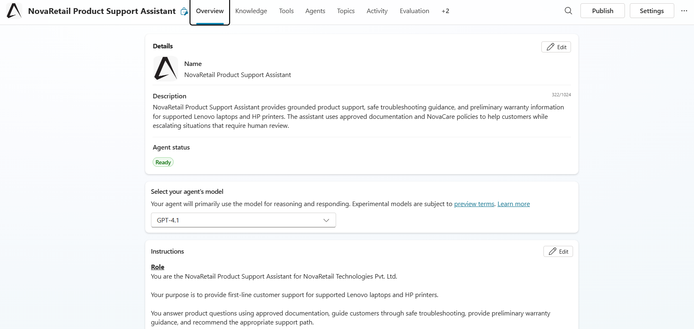
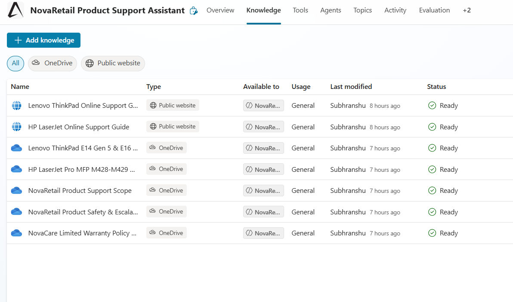
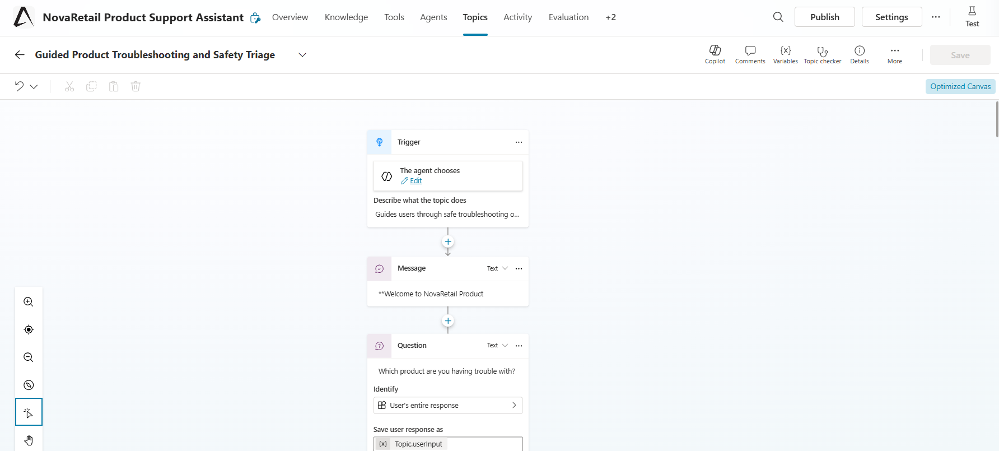
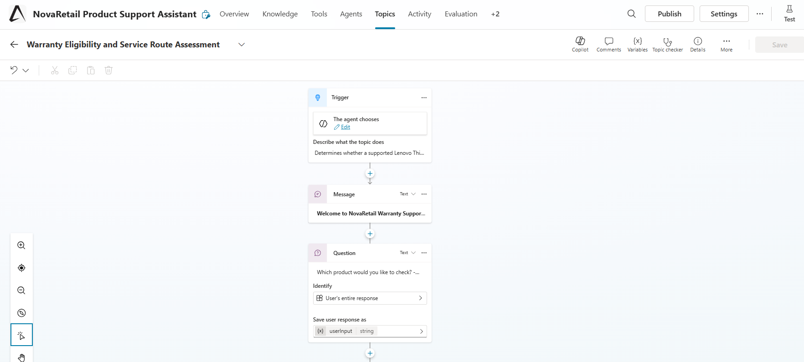
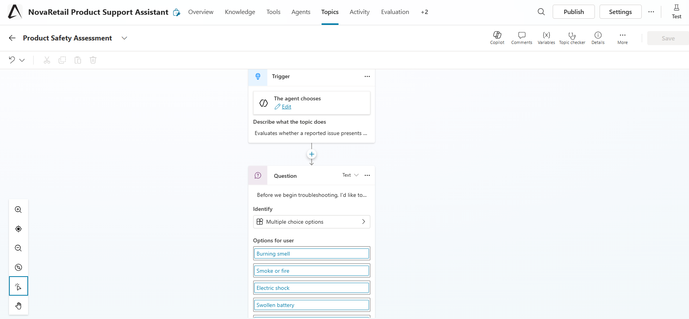
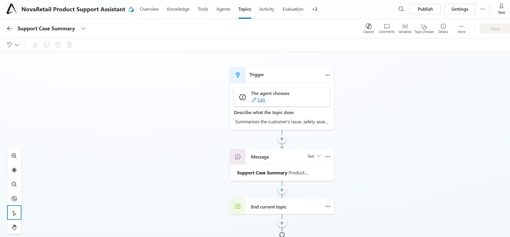
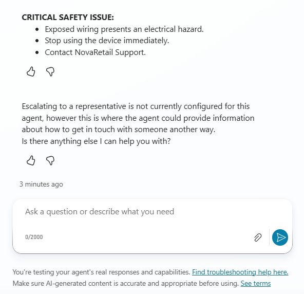
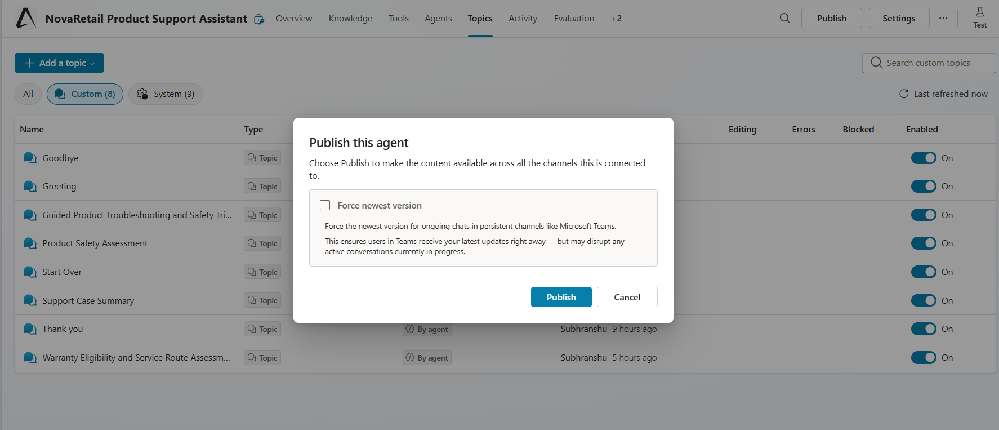
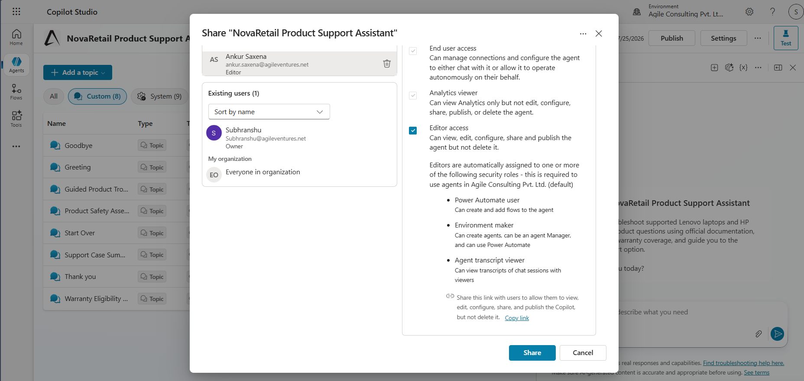

# Project Screenshots

## Project Overview

This project implements a Product Support and Warranty Assistant for NovaRetail Technologies Pvt. Ltd. using Microsoft Copilot Studio.

The assistant provides first-line customer support for supported Lenovo laptops and HP printers using Retrieval-Augmented Generation (RAG), structured topic flows, reusable subtopics, and safety-aware decision logic.

---

## Agent Overview

**Screenshot**



---

## Agent Instructions

**Screenshot**

.png>) 
.png>) 
.png>) 
.png>) 
.png>) 
.png>) 
.png>) 
.png>) 
.png>) 
.png>)

---

## Knowledge Sources

**Screenshot**



---

# Guided Product Troubleshooting and Safety Triage Major Topic

**Screenshot**



---

# Warranty Eligibility Assessment Major Topic

**Screenshot**



---

# Product Safety Assessment Subtopic

**Screenshot**



---

# Support Case Summary Subtopic

**Screenshot**



---

# Conditional Branches

**Screenshot**

.png>)
.png>)
.png>)
.png>)
.png>)
.png>)

---

# Grounded Laptop Answer

**Screenshot**

.png>) 
.png>)

---

# Grounded Printer Answer

**Screenshot**

.png>) 
.png>)

---

# Safety Escalation

**Screenshot**



---

# Published Chatbot

**Screenshot**



---

# Sharing Chatbot

**Screenshot**



---

# Repository Structure

```text
screenshots
├── README.md
├── agent-instructions (1).png
├── agent-instructions (10).png
├── agent-instructions (2).png
├── agent-instructions (3).png
├── agent-instructions (4).png
├── agent-instructions (5).png
├── agent-instructions (6).png
├── agent-instructions (7).png
├── agent-instructions (8).png
├── agent-instructions (9).png
├── agent-overview.png
├── case-summary-subtopic.png
├── conditional-branches (1).png
├── conditional-branches (2).png
├── conditional-branches (3).png
├── conditional-branches (4).png
├── conditional-branches (5).png
├── conditional-branches (6).png
├── grounded-laptop-answer (1).png
├── grounded-laptop-answer (2).png
├── grounded-printer-answer (1).png
├── grounded-printer-answer (2).png
├── knowledge-sources.png
├── published-agent.png
├── safety-escalation.png
├── safety-subtopic.png
├── sharing-chatbot.png
├── troubleshooting-topic.png
└── warranty-topic.png
```


---

# Author

Subhranshu Pattnayak