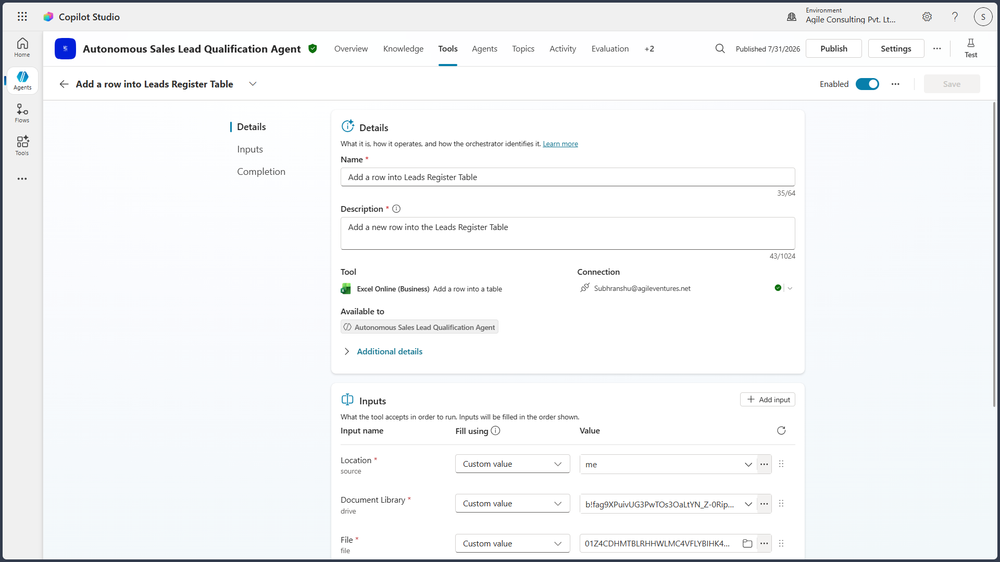

# Tool Design

## Purpose

This document describes the Microsoft Copilot Studio tools configured for the Autonomous Sales Lead Qualification Agent. The tools enable the agent to interact with Microsoft 365 services and execute the autonomous workflow by retrieving operational data, generating reports, updating records, and sending communications.

---

# Tool Architecture

The agent uses Microsoft 365 connectors and AI prompt tools to complete the lead qualification process.

> **Screenshot – Configured Tools**

---

# Tool Overview

| Tool | Purpose |
|------|---------|
| Office 365 Outlook | Trigger the workflow and send email communications |
| Excel Online | Read operational reference data and maintain the Lead Register |
| Microsoft Word Business | Generate standardized lead qualification reports |
| AI Prompt Tools | Perform extraction, normalization, scoring, and decision making |

---

# Office 365 Outlook

The Outlook connector serves two purposes:

- Initiates the autonomous workflow when a new lead email arrives.
- Sends customer acknowledgements, requests for additional information, and internal notifications after processing.

### Inputs

- Sender Email
- Subject
- Email Body

### Outputs

- Outbound customer emails
- Internal notifications

> **Screenshot – Outlook Configuration**

---

# Excel Online

Excel Online is used as the operational data store.

The agent retrieves:

- Qualification Rules
- Product Catalog
- Territory Mapping
- Sales Owner Mapping
- Action Matrix

The agent also updates the Lead Register with the processed lead information.

### Operations

- Read reference tables
- Check for duplicates
- Create new lead records
- Update processing status

> **Screenshot – Only one List Excel Configuration**

> **Screenshot – Add Excel Configuration**

> **Screenshot – Update Excel Configuration**

---

# Microsoft Word Business

The Word Business connector generates a standardized Lead Qualification Report for processed sales opportunities.

The report summarizes:

- Extracted lead details
- Qualification score
- Classification
- Assigned owner
- Recommended actions

The generated report location is recorded in the Lead Register.

> **Screenshot – Word Configuration**

---

# Tool Execution Sequence

The tools execute in the following order:

1. Outlook Trigger
2. AI Extraction and Normalization
3. Excel Reference Lookup
4. Qualification and Classification
5. Excel Lead Register Update
6. Word Report Generation
7. Outlook Communications

---

# Error Handling

Each tool performs validation before execution.

The agent records failures caused by:

- Connector authentication issues
- Missing operational data
- Report generation failures
- Email delivery failures

Transient connector failures are retried according to the configured workflow before escalation.
