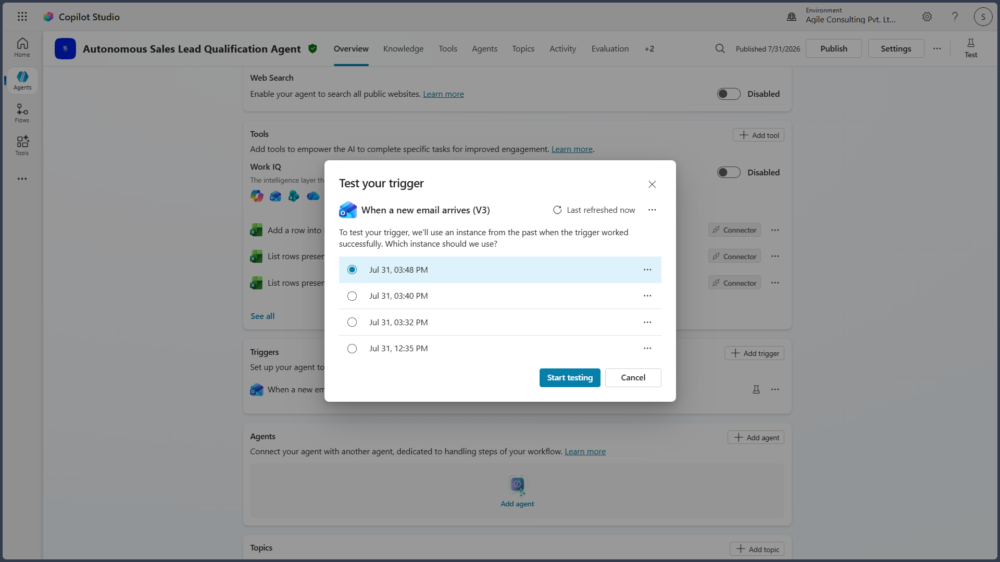

# Trigger Design

## Purpose

This document describes the trigger configuration used by the Autonomous Sales Lead Qualification Agent. The trigger initiates the autonomous workflow whenever a qualifying sales lead email is received in the configured Outlook mailbox.

---

# Trigger Overview

The solution uses the **Office 365 Outlook – When a new email arrives (V3)** trigger to automatically start the lead qualification process.

The trigger eliminates manual intervention by initiating the AI workflow immediately after a valid sales inquiry is received.

> **Screenshot – Outlook Trigger Configuration**

---

# Trigger Configuration

| Property | Configuration |
|-----------|---------------|
| Connector | Office 365 Outlook |
| Trigger | When a new email arrives (V3) |
| Mailbox | Configured Organizational Mailbox |
| Event Type | New Email |
| Processing Mode | Autonomous |

---

# Trigger Inputs

The trigger provides the following information to the AI agent:

- Sender Email Address
- Email Subject
- Email Body
- Message Identifier
- Date and Time Received

These inputs form the basis for lead extraction and qualification.

---

# Trigger Validation

Before processing begins, the agent validates that:

- A new email has been received.
- The email contains readable content.
- The email body is available for processing.
- Required metadata has been successfully retrieved.

If the trigger cannot retrieve the required information, processing is terminated and the failure is logged.

---

# Processing Flow

After successful validation, the trigger transfers control to the AI orchestration workflow, which performs:

1. Lead information extraction
2. Data normalization
3. Duplicate detection
4. Qualification and scoring
5. Lead classification
6. Sales owner assignment
7. Excel update
8. Word report generation
9. Outlook communications
10. Completion recording

---

# Error Handling

The trigger handles the following conditions:

- Missing email content
- Connector authentication failure
- Outlook service interruption
- Invalid trigger payload

Transient failures are retried according to the configured connector behavior. If processing cannot continue, the workflow records the failure and terminates gracefully.

---

# Limitations

The trigger depends on:

- Microsoft 365 Outlook availability
- Valid organizational authentication
- Configured Outlook connector permissions

Emails that cannot be retrieved or processed are not automatically reclassified and require manual investigation if necessary.