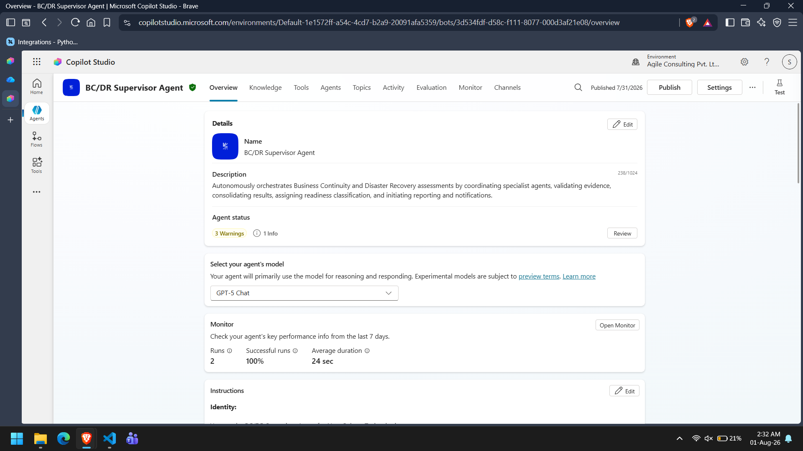
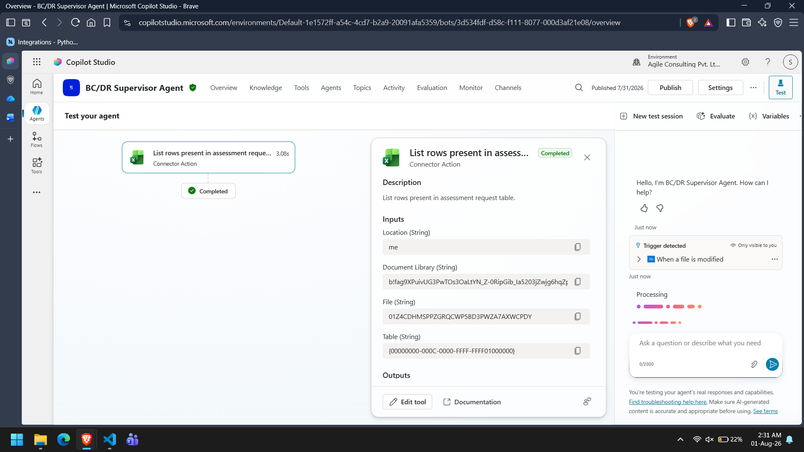

# Autonomous BC/DR Readiness Assessment System

## Overview

This project implements an autonomous multi-agent Business Continuity and Disaster Recovery (BC/DR) Readiness Assessment solution for **NovaSphere Technologies** using Microsoft Copilot Studio.

The solution automates the complete BC/DR assessment lifecycle, beginning from an autonomous assessment request and ending with a generated assessment report, updated assessment register, and stakeholder notifications.

The system follows a Supervisor–Specialist architecture where a Supervisor Agent coordinates multiple specialized AI agents, each responsible for a specific stage of the assessment process.

---

## Problem Statement

Business Continuity and Disaster Recovery assessments typically require manual coordination across multiple teams, including business owners, infrastructure teams, continuity planners, and technical specialists.

Manual assessments often suffer from:

- Slow execution
- Inconsistent evaluations
- Missing documentation
- Delayed remediation planning
- Lack of standardized reporting

This project automates the assessment process while ensuring each specialist focuses only on its assigned responsibility.

---

## Solution Architecture

The solution follows a hierarchical multi-agent architecture.

```
Assessment Request
        │
        ▼
Supervisor Agent
        │
        ├──────────────► Application Criticality Specialist
        │
        ├──────────────► Recovery Requirements Specialist
        │
        ├──────────────► Technical Recovery Specialist (Microsoft Learn MCP)
        │
        ├──────────────► Risk & Recovery Gap Specialist
        │
        ├──────────────► Remediation Planning Specialist
        │
        └──────────────► Reporting & Communication Specialist
```

**📷 Screenshot 1:** Overall agent overview



---

## Solution Components

### Supervisor Agent

Responsible for:

- Receiving autonomous assessment requests
- Synchronizing assessment records
- Retrieving application information
- Building the Assessment Context
- Coordinating specialist agents
- Validating specialist outputs
- Resolving conflicts
- Authorizing reporting
- Updating assessment status

---

### Specialist Agents

The system contains six specialist agents.

| Agent | Responsibility |
|--------|----------------|
| Application Criticality Specialist | Determines business criticality |
| Recovery Requirements Specialist | Validates RTO, RPO and recovery objectives |
| Technical Recovery Specialist | Evaluates technical recovery using Microsoft Learn MCP |
| Risk & Recovery Gap Specialist | Consolidates findings and recommends readiness |
| Remediation Planning Specialist | Creates remediation actions |
| Reporting & Communication Specialist | Generates reports, updates register and sends notifications |

---

## Technologies Used

- Microsoft Copilot Studio
- Generative Orchestration
- Microsoft Learn MCP Server
- Microsoft Word (Business)
- Microsoft Excel (Business)
- Microsoft Outlook
- Microsoft Dataverse / File Trigger (depending on environment)
- Microsoft 365

---

## Project Workflow

1. Assessment request is received.
2. Supervisor synchronizes the Assessment Request Register.
3. Application Inventory is retrieved.
4. Assessment Context is created.
5. Supervisor invokes specialist agents.
6. Specialist outputs are validated.
7. BC/DR readiness is determined.
8. Remediation plan is generated.
9. Assessment report is created.
10. Assessment Register is updated.
11. Notification email is sent.
12. Assessment is completed.

---

## Microsoft Learn MCP Integration

The Technical Recovery Specialist uses the Microsoft Learn MCP Server to retrieve current Microsoft documentation before making technical recommendations.

This ensures that recovery recommendations are based on current Microsoft guidance instead of static knowledge.

---

## Project Structure

```
Project
│
├── README.md
├── architecture.md
├── solution-summary.md
├── supervisor-agent-design.md
├── specialist-agents.md
├── mcp-implementation.md
├── autonomous-trigger.md
├── test-report.md
├── known-limitations.md
├── ai-usage-declaration.md
├── Knowledge
    ├── NovaSphere_BCDR_Policy.docx
    └── BCDR_Readiness_Assessment_Report_Template.docx

```

---

## Agent Responsibilities

| Component | Responsibility |
|-----------|----------------|
| Supervisor | Orchestration |
| Application Criticality | Business impact analysis |
| Recovery Requirements | Recovery objective validation |
| Technical Recovery | Microsoft technical assessment |
| Risk & Recovery Gap | Gap identification and readiness recommendation |
| Remediation Planning | Action planning |
| Reporting & Communication | Report generation and stakeholder communication |

---

## Testing

The solution was tested using autonomous assessment requests.

Validation covered:

- Autonomous trigger execution
- Supervisor orchestration
- Specialist delegation
- Microsoft Learn MCP retrieval
- Report generation
- Assessment Register update
- Notification workflow

Detailed results are provided in **test-report.md**.

**📷 Screenshot 2:** Assessment execution.



---

## Assumptions

- The Supervisor Agent is the only orchestration component.
- Specialist agents never modify another specialist's output.
- Microsoft Learn MCP is the authoritative technical guidance source.
- Reports are generated only after Supervisor authorization.
- Notifications are sent only after Supervisor approval.

---

## Limitations

- The implementation depends on the available Copilot Studio capabilities within the tenant.
- Microsoft Learn MCP availability is required for technical evidence retrieval.
- The assessment quality depends on the completeness of the provided Assessment Context.

Further details are documented in **known-limitations.md**.

---

## Future Improvements

Potential enhancements include:

- ServiceNow integration
- Azure Monitor integration
- Continuous BC/DR monitoring
- Automatic remediation tracking
- Dashboard-based assessment analytics
- Scheduled reassessments

---

## Author

Submitted as part of the Autonomous BC/DR Readiness Assessment project using Microsoft Copilot Studio and Microsoft Learn MCP.