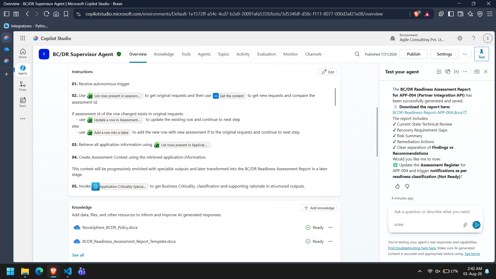

# System Architecture

## Overview

The Autonomous BC/DR Readiness Assessment System follows a hierarchical multi-agent architecture implemented using Microsoft Copilot Studio.

A single Supervisor Agent coordinates multiple specialist agents, each responsible for a single assessment domain. This separation of responsibilities ensures modularity, maintainability, and deterministic execution.

The architecture follows an orchestration pattern where the Supervisor controls execution while specialist agents perform domain-specific analysis.

---

# High-Level Architecture

```
                           Assessment Request
                                   │
                                   ▼
                        Autonomous Trigger
                                   │
                                   ▼
                          Supervisor Agent
                                   │
      ┌───────────────┬────────────┼────────────┬───────────────┐
      ▼               ▼            ▼            ▼               ▼
Application      Recovery      Technical     Risk & Gap    Remediation
Criticality     Requirements    Recovery      Specialist    Planning
 Specialist      Specialist     Specialist
                                     │
                                     ▼
                         Microsoft Learn MCP
                                     │
                                     ▼
                    Reporting & Communication
                                   │
                 ┌─────────────────┴────────────────┐
                 ▼                                  ▼
        Word Assessment Report          Excel Register Update
                                                   │
                                                   ▼
                                           Outlook Notification
```

---

# Architectural Principles

The solution is based on the following design principles:

- Single orchestration point
- Single responsibility per specialist
- Evidence-based decision making
- Structured inter-agent communication
- Separation of business and technical analysis
- Supervisor-controlled execution
- Modular and extensible architecture

---

# Component Overview

## Autonomous Trigger

The assessment begins when a new assessment request is received.

The trigger activates the Supervisor Agent without requiring manual interaction.

Responsibilities:

- Detect new assessment request
- Start assessment workflow
- Pass request information to the Supervisor

---

## Supervisor Agent

The Supervisor Agent coordinates the complete assessment lifecycle.

Responsibilities:

- Receive assessment request
- Synchronize assessment records
- Retrieve Application Inventory
- Create Assessment Context
- Invoke specialist agents
- Validate specialist outputs
- Handle reassessment
- Resolve conflicts
- Determine final readiness
- Authorize reporting
- Update assessment status

The Supervisor performs orchestration only and never performs specialist analysis.

**📷 Screenshot 1:** Supervisor Agent configuration.



---

## Specialist Layer

Each specialist performs exactly one responsibility.

### Application Criticality Specialist

Determines business criticality using the NovaSphere BC/DR Policy.

Knowledge:

- NovaSphere BC/DR Policy

Tools:

- None

---

### Recovery Requirements Specialist

Evaluates recovery objectives and identifies inconsistencies.

Knowledge:

- NovaSphere BC/DR Policy

Tools:

- None

---

### Technical Recovery Specialist

Evaluates technical recovery capability using current Microsoft guidance.

Knowledge:

- None

Tools:

- Microsoft Learn MCP Server

---

### Risk & Recovery Gap Specialist

Aggregates specialist findings and recommends readiness.

Knowledge:

- NovaSphere BC/DR Policy

Tools:

- None

---

### Remediation Planning Specialist

Creates prioritized remediation actions.

Knowledge:

- None

Tools:

- None

---

### Reporting & Communication Specialist

Generates final assessment artifacts.

Knowledge:

- BC/DR Readiness Assessment Report Template

Tools:

- Microsoft Word
- Microsoft Excel
- Microsoft Outlook

---

# Data Flow

The assessment follows the data flow shown below.

```
    Assessment Request
    
        ↓
    
    Assessment Register Synchronization
    
        ↓
    
    Application Inventory Retrieval
    
        ↓
    
    Assessment Context
    
        ↓
    
    Application Criticality
    
        ↓
    
    Recovery Requirements
    
        ↓
    
    Technical Recovery
    
        ↓
    
    Risk & Recovery Gap
    
        ↓
    
    Remediation Planning
    
        ↓
    
    Supervisor Validation
    
        ↓
    
    Reporting
    
        ↓
    
    Assessment Register Update
    
        ↓
    
    Notification
```

---

# Assessment Context

The Assessment Context is the central data object shared between all agents.

It contains:

- Assessment metadata
- Application details
- Business information
- Recovery configuration
- Specialist outputs
- Validation status
- Final readiness
- Remediation information

The Supervisor progressively enriches the Assessment Context throughout the assessment lifecycle.

---

# Knowledge Architecture

The solution separates business knowledge from technical knowledge.

| Agent | Knowledge Source |
|--------|------------------|
| Application Criticality | NovaSphere BC/DR Policy |
| Recovery Requirements | NovaSphere BC/DR Policy |
| Technical Recovery | Microsoft Learn MCP |
| Risk & Recovery Gap | NovaSphere BC/DR Policy |
| Remediation Planning | None |
| Reporting & Communication | BC/DR Readiness Assessment Report Template |

This separation ensures that each agent accesses only the knowledge relevant to its responsibility.

---

# Tool Architecture

The following tools are used across the solution.

| Component | Tool |
|-----------|------|
| Supervisor | Excel Business |
| Technical Recovery | Microsoft Learn MCP |
| Reporting | Word Business |
| Reporting | Excel Business |
| Reporting | Outlook |

No other specialist agent accesses external tools.

---

# Error Handling

The Supervisor implements centralized error handling.

Failure scenarios include:

- Missing assessment data
- Missing application inventory
- Specialist failure
- MCP retrieval failure
- Report generation failure
- Notification failure

The Supervisor retries failed specialist executions once before escalating the assessment for manual review.

---

# Security Model

The architecture follows the principle of least privilege.

- Specialist agents access only the information required for their responsibility.
- Technical documentation is retrieved only through Microsoft Learn MCP.
- Reports are generated only after Supervisor approval.
- Notifications are sent only after Supervisor authorization.

---

# Scalability

The modular architecture enables future enhancements, including:

- Additional specialist agents
- ServiceNow integration
- Azure Monitor integration
- Automated reassessment scheduling
- Continuous BC/DR monitoring
- Dashboard reporting

The Supervisor architecture remains unchanged while new specialists can be integrated as independent components.

---

# Conclusion

The implemented architecture provides a modular, scalable, and maintainable framework for autonomous BC/DR readiness assessments.

By separating orchestration, business analysis, technical evaluation, remediation planning, and reporting into independent specialist agents, the solution improves consistency, simplifies maintenance, and enables future enterprise expansion.