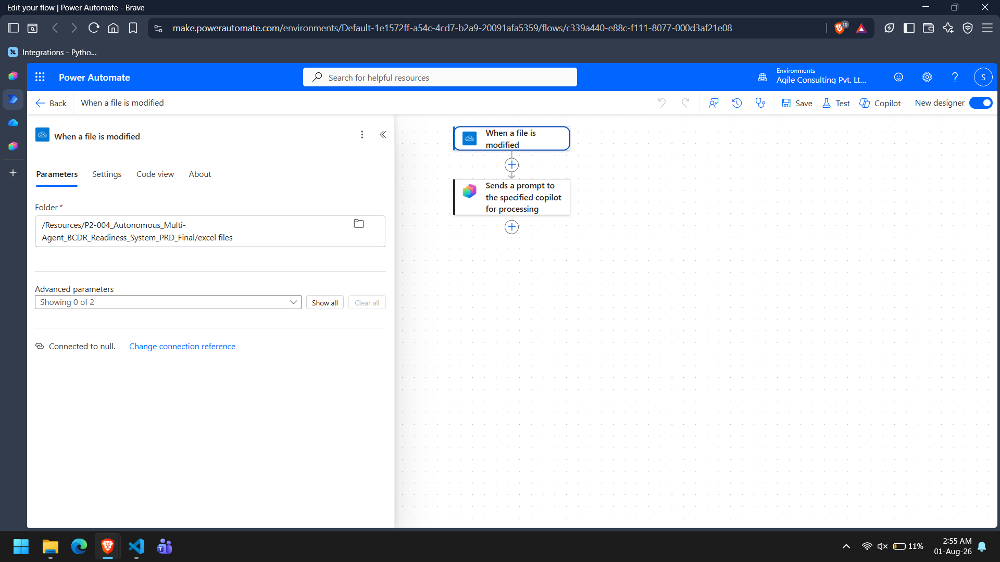

# Autonomous Trigger

## Overview

The assessment process begins automatically when a new assessment request is detected in the txt file.

The autonomous trigger starts the Supervisor Agent without requiring manual user interaction.

---

## Trigger Flow

```
Assessment Request

↓

Autonomous Trigger

↓

Supervisor Agent

↓

Assessment Workflow
```

**📷 Screenshot 1:** Trigger configuration.



---

## Trigger Source

The implementation uses a monitored assessment request file as the ingestion source.

When a new assessment request is detected:

- The Supervisor Agent is invoked.
- The Assessment Request Register is synchronized.
- The assessment workflow begins.

---

## Processing Steps

The Supervisor performs the following actions after the trigger fires:

- Synchronize the Assessment Request Register.
- Retrieve Application Inventory.
- Create the Assessment Context.
- Invoke specialist agents.
- Validate assessment results.
- Authorize reporting.

---

## Validation

The trigger validates:

- Assessment ID exists.
- Application ID exists.
- Request status is valid.
- Required fields are present.

If validation fails, the assessment is marked as **Insufficient Evidence** and no specialist agents are invoked.

---

## Benefits

- Fully autonomous execution.
- No manual assessment initiation.
- Consistent assessment workflow.
- Automatic request synchronization.

---

## Conclusion

The autonomous trigger provides a reliable starting point for the BC/DR assessment workflow by automatically initiating the Supervisor Agent whenever a valid assessment request is received.