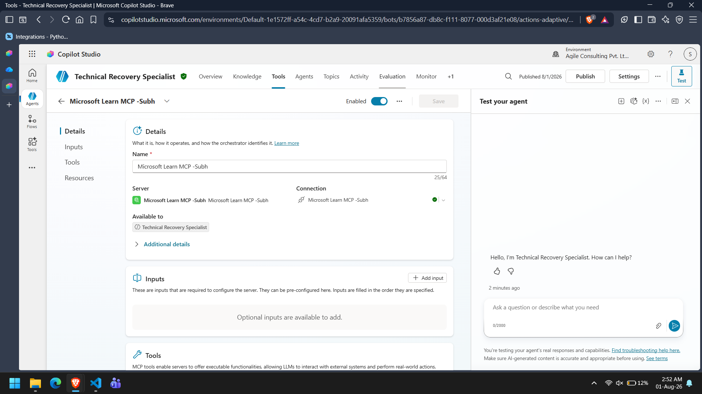

# Microsoft Learn MCP Implementation

## Overview

The Technical Recovery Specialist integrates with the Microsoft Learn MCP Server to retrieve current Microsoft documentation during technical recovery assessments.

This ensures technical recommendations are based on official Microsoft guidance rather than model knowledge.

---

## Purpose

The MCP integration is used to:

- Retrieve Microsoft Learn documentation.
- Validate technical recovery configurations.
- Support evidence-based recommendations.

---

## Configuration

**MCP Server**

- Microsoft Learn MCP Server

**Transport**

- Streamable HTTP

**Authentication**

- None

**Enabled Tools**

- microsoft_docs_search
- microsoft_docs_fetch

All other MCP tools were disabled as they were not required for this project.

**📷 Screenshot 1:** Microsoft Learn MCP configuration.



---

## Workflow

```
Assessment Context

↓

Technical Recovery Specialist

↓

Microsoft Learn MCP

↓

Microsoft Documentation

↓

Technical Assessment

↓

Supervisor Agent
```

---

## Error Handling

If Microsoft documentation cannot be retrieved:

- Return **Technical Evidence Unavailable**.
- Reduce confidence.
- Do not invent Microsoft recommendations.
- Return the result to the Supervisor Agent.

---

## Benefits

- Current Microsoft guidance
- Evidence-based assessments
- Reduced hallucination
- Consistent technical recommendations

---

## Conclusion

Microsoft Learn MCP enables the Technical Recovery Specialist to perform reliable technical assessments using official Microsoft documentation while keeping business analysis separate from technical guidance.