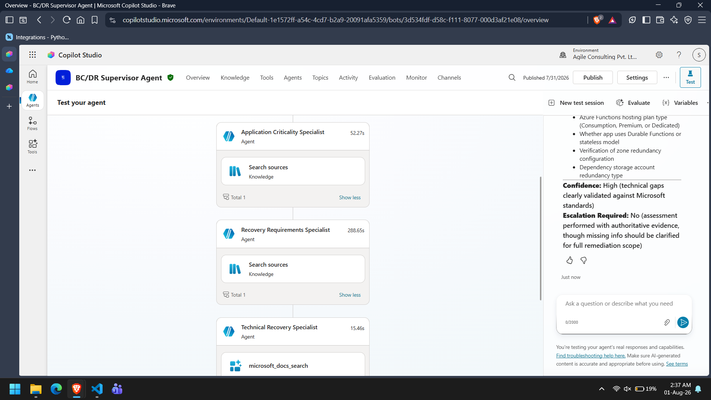

# Solution Summary

## Project Overview

The Autonomous BC/DR Readiness Assessment System is a multi-agent solution built using Microsoft Copilot Studio to automate Business Continuity and Disaster Recovery (BC/DR) assessments for NovaSphere Technologies.

The solution replaces a traditionally manual assessment process with a Supervisor–Specialist architecture, where a Supervisor Agent coordinates multiple autonomous specialist agents responsible for individual assessment domains.

The system evaluates application criticality, recovery requirements, technical recovery capabilities, BC/DR readiness, remediation planning, and reporting before producing a final assessment report and stakeholder notifications.

---

# Objectives

The solution was designed to achieve the following objectives:

- Automate BC/DR readiness assessments.
- Separate responsibilities across specialist agents.
- Ensure consistent evidence-based decision making.
- Integrate Microsoft Learn MCP for technical guidance.
- Generate standardized assessment reports.
- Maintain assessment records automatically.
- Reduce manual effort while improving assessment consistency.

---

# Solution Architecture

The implementation follows a hierarchical orchestration model.

```
Assessment Request
        │
        ▼
Supervisor Agent
        │
        ├────────► Application Criticality Specialist
        ├────────► Recovery Requirements Specialist
        ├────────► Technical Recovery Specialist
        ├────────► Risk & Recovery Gap Specialist
        ├────────► Remediation Planning Specialist
        └────────► Reporting & Communication Specialist
```

The Supervisor Agent performs orchestration only and delegates all domain-specific analysis to specialist agents.

**📷 Screenshot 1:** Supervisor Agent orchestration.



---

# Supervisor Agent

The Supervisor Agent is responsible for:

- Receiving autonomous assessment requests.
- Synchronizing assessment records.
- Retrieving application information.
- Creating the Assessment Context.
- Delegating work to specialist agents.
- Validating specialist responses.
- Handling missing evidence.
- Managing reassessment when required.
- Determining the final readiness classification.
- Authorizing reporting and notifications.

The Supervisor never performs specialist analysis directly.

---

# Specialist Agents

The solution contains six specialist agents.

## Application Criticality Specialist

Determines business criticality based on business impact, customer impact, operational dependency, and policy definitions.

Knowledge Source:

- NovaSphere BC/DR Policy

---

## Recovery Requirements Specialist

Validates recovery objectives including RTO, RPO, maximum tolerable downtime, and dependency recovery requirements.

Knowledge Source:

- NovaSphere BC/DR Policy

---

## Technical Recovery Specialist

Evaluates technical recovery capabilities using current Microsoft documentation.

External Integration:

- Microsoft Learn MCP Server

---

## Risk & Recovery Gap Specialist

Consolidates specialist findings to identify BC/DR gaps and recommend an overall readiness classification.

Knowledge Source:

- NovaSphere BC/DR Policy

---

## Remediation Planning Specialist

Converts validated BC/DR gaps into prioritized remediation tasks.

No external knowledge source is required.

---

## Reporting & Communication Specialist

Generates the final BC/DR assessment report, updates the assessment register, and sends stakeholder notifications.

Knowledge Source:

- BC/DR Readiness Assessment Report Template

---

# Assessment Workflow

The assessment lifecycle consists of the following stages:

1. Assessment request received.
2. Assessment request synchronized.
3. Application Inventory retrieved.
4. Assessment Context created.
5. Specialist assessments executed.
6. Outputs validated.
7. Readiness determined.
8. Remediation plan created.
9. Assessment report generated.
10. Assessment Register updated.
11. Stakeholders notified.
12. Assessment completed.

---

# Microsoft Learn MCP Integration

The Technical Recovery Specialist uses Microsoft Learn MCP to retrieve current Microsoft documentation before making technical recommendations.

This ensures recommendations remain aligned with current Microsoft guidance instead of relying solely on language model knowledge.

Only the Technical Recovery Specialist is permitted to access Microsoft Learn MCP.

---

# Implementation Decisions

Several implementation decisions were made to improve compatibility with the available Copilot Studio environment.

### Assessment Request Ingestion

The original design expected an Excel-based autonomous trigger.

Due to connector availability within the environment, assessment requests are submitted through a monitored text file, which is synchronized with the Assessment Request register before the assessment begins.

This preserves a single operational source of truth while maintaining autonomous execution.

---

### Separation of Responsibilities

Each specialist agent performs exactly one responsibility.

The Supervisor Agent never overrides specialist conclusions and only consolidates validated outputs.

This separation improves maintainability and prevents duplicated analysis.

---

### Structured Outputs

All specialist agents return structured responses containing:

- Assessment Status
- Findings
- Missing Information
- Confidence
- Escalation Requirement

This enables deterministic orchestration and simplifies downstream processing.

---

# Technologies Used

- Microsoft Copilot Studio
- Generative Orchestration
- Microsoft Learn MCP Server
- Microsoft Word (Business)
- Microsoft Excel (Business)
- Microsoft Outlook
- Microsoft 365

---

# Deliverables

The solution produces the following outputs:

- BC/DR Readiness Assessment Report
- Updated Assessment Register
- Readiness Classification
- Risk Summary
- Remediation Plan
- Stakeholder Notification

---

# Conclusion

The implemented solution demonstrates how autonomous multi-agent orchestration can streamline BC/DR readiness assessments while maintaining clear separation of responsibilities, evidence-based technical analysis, and standardized reporting.

The architecture is modular, scalable, and extensible for future enterprise integrations.