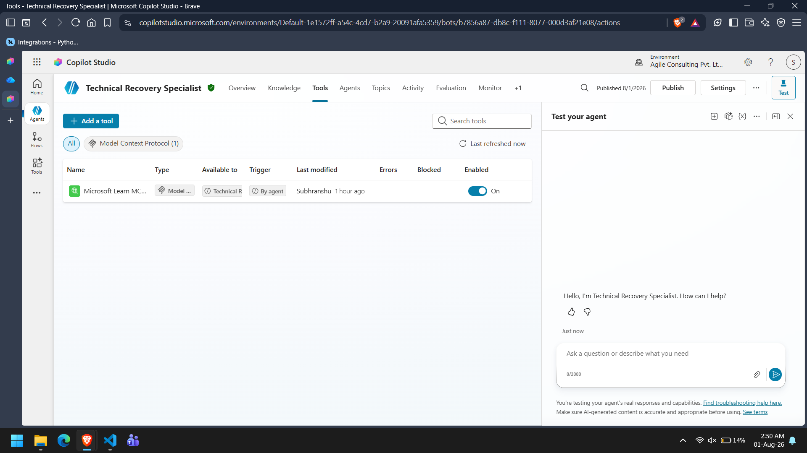
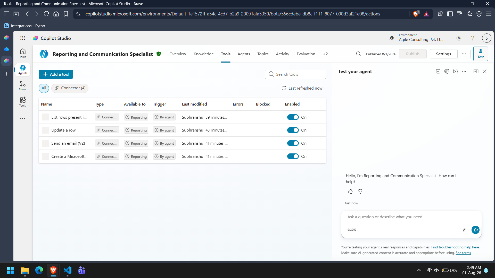

# Specialist Agent Design

## Overview

The Autonomous BC/DR Readiness Assessment System uses a collection of specialist agents coordinated by the Supervisor Agent.

Each specialist is responsible for exactly one assessment domain and returns structured outputs back to the Supervisor.

This design follows the Single Responsibility Principle, ensuring that business analysis, technical analysis, remediation planning, and reporting remain independent.

---

# Specialist Architecture

```
                    Supervisor Agent
                           │
 ┌──────────────┬──────────┼──────────┬─────────────┬──────────────┐
 ▼              ▼          ▼          ▼             ▼
Application   Recovery   Technical   Risk & Gap   Remediation
Criticality  Requirements Recovery    Specialist   Planning
 Specialist   Specialist Specialist
                           │
                           ▼
                   Microsoft Learn MCP
                           │
                           ▼
              Reporting & Communication
```

**📷 Screenshot 1:** Specialist agent hierarchy.

---

# Common Design Principles

Every specialist follows the same design pattern.

- Receives Assessment Context from the Supervisor.
- Uses only the information relevant to its assigned responsibility.
- Never modifies the Assessment Context.
- Never performs another specialist's responsibility.
- Returns structured outputs.
- Reports missing information instead of making assumptions.

---

# 1. Application Criticality Specialist

## Purpose

Determines the business criticality of the application using organizational policy.

## Responsibilities

- Evaluate business impact.
- Evaluate customer impact.
- Evaluate financial impact.
- Evaluate operational dependency.
- Classify business criticality.
- Provide supporting rationale.

## Inputs

- Assessment Context

## Knowledge Source

- NovaSphere BC/DR Policy

## Tools

- None

## Output

- Business Criticality
- Business Impact Summary
- Supporting Rationale
- Confidence
- Missing Information

---

# 2. Recovery Requirements Specialist

## Purpose

Evaluates whether the application's recovery objectives align with business continuity requirements.

## Responsibilities

- Validate RTO.
- Validate RPO.
- Validate Maximum Tolerable Downtime.
- Evaluate dependency recovery.
- Detect inconsistencies.
- Recommend recovery requirements.

## Inputs

- Assessment Context
- Business Criticality

## Knowledge Source

- NovaSphere BC/DR Policy

## Tools

- None

## Output

- Recovery Requirements Assessment
- Detected Inconsistencies
- Recommended Recovery Requirements
- Confidence
- Missing Information

---

# 3. Technical Recovery Specialist

## Purpose

Evaluates technical recovery capability using current Microsoft guidance.

## Responsibilities

- Assess backup configuration.
- Assess disaster recovery capability.
- Assess recovery testing.
- Assess documentation.
- Compare implementation against Microsoft guidance.
- Recommend technical improvements.

## Inputs

- Assessment Context

## Knowledge Source

- None

## Tools

- Microsoft Learn MCP

## Output

- Technical Recovery Assessment
- Microsoft Guidance Summary
- Technical Gaps
- Recommended Improvements
- MCP Evidence Status

**📷 Screenshot 2:** Microsoft Learn MCP configured for the Technical Recovery Specialist.

---

# 4. Risk & Recovery Gap Specialist

## Purpose

Consolidates specialist findings and recommends BC/DR readiness.

## Responsibilities

- Review specialist outputs.
- Identify validated BC/DR gaps.
- Assign risk levels.
- Recommend readiness classification.

## Inputs

- Application Criticality output
- Recovery Requirements output
- Technical Recovery output

## Knowledge Source

- NovaSphere BC/DR Policy

## Tools

- None

## Output

- Risk Summary
- Gap Summary
- Readiness Recommendation

---

# 5. Remediation Planning Specialist

## Purpose

Converts validated gaps into actionable remediation tasks.

## Responsibilities

- Review validated gaps.
- Create remediation actions.
- Assign priorities.
- Recommend ownership.
- Define validation requirements.

## Inputs

- Risk & Recovery Gap output

## Knowledge Source

- None

## Tools

- None

## Output

- Remediation Plan
- Priorities
- Suggested Owners
- Validation Requirements

---

# 6. Reporting & Communication Specialist

## Purpose

Generates final assessment artifacts after Supervisor approval.

## Responsibilities

- Generate assessment report.
- Update Assessment Register.
- Send stakeholder notifications.

## Inputs

- Approved Assessment Context
- Final Readiness
- Supervisor Authorization

## Knowledge Source

- BC/DR Readiness Assessment Report Template

## Tools

- Microsoft Word
- Microsoft Excel
- Microsoft Outlook

## Output

- Assessment Report
- Updated Assessment Register
- Notification Status

**📷 Screenshot 3:** Reporting & Communication Specialist tools.

---

# Specialist Interaction

Specialists never communicate directly with one another.

All communication is routed through the Supervisor Agent.

```
Supervisor

↓

Assessment Context

↓

Specialist

↓

Structured Output

↓

Supervisor
```

This centralized communication model prevents dependency between specialists and simplifies orchestration.

---

# Structured Output Standard

Every specialist returns a consistent response containing:

- Specialist Name
- Assessment Status
- Findings
- Recommendations (where applicable)
- Missing Information
- Confidence
- Escalation Required

The standardized output simplifies validation and downstream processing.

---

# Error Handling

Each specialist follows a common error-handling strategy.

- Never invent missing information.
- Report missing evidence.
- Reduce confidence when evidence is incomplete.
- Return structured responses even when the assessment is partial.
- Stop processing after returning the response.

The Supervisor determines whether reassessment or escalation is required.

---

# Benefits of the Specialist Design

The specialist architecture provides:

- Clear separation of responsibilities.
- Independent assessment domains.
- Modular design.
- Easier maintenance.
- Simplified testing.
- Reusable assessment components.
- Scalable multi-agent orchestration.

---

# Screenshots

Include only the following screenshots.

**📷 Screenshot 1** All specialist agents in Copilot Studio.


---

**📷 Screenshot 2** Technical Recovery Specialist showing Microsoft Learn MCP.



---

**📷 Screenshot 3** Reporting & Communication Specialist showing Word, Excel, and Outlook tools.



---

# Conclusion

The specialist-based architecture enables the BC/DR assessment process to be divided into independent, focused responsibilities coordinated by a single Supervisor Agent. This approach improves maintainability, consistency, and extensibility while ensuring each assessment domain is evaluated using the appropriate knowledge sources and tools.