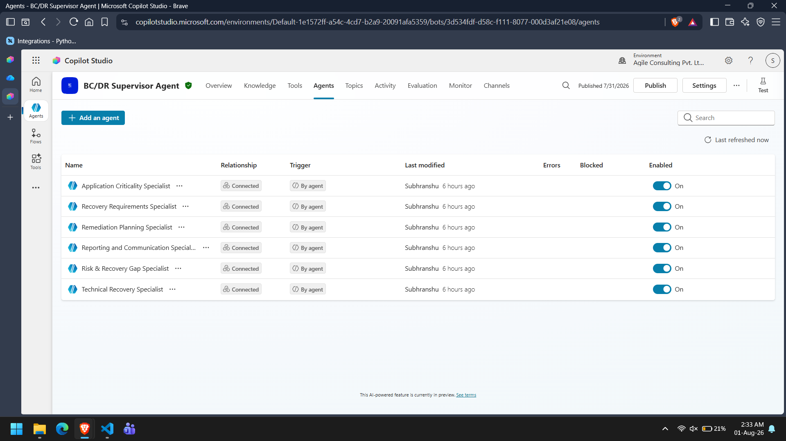
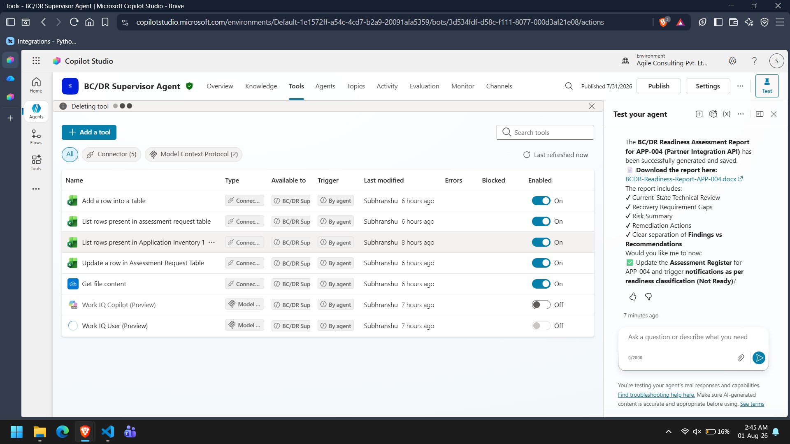

# Supervisor Agent Design

## Overview

The Supervisor Agent is the central orchestration component of the Autonomous BC/DR Readiness Assessment System.

It coordinates the complete assessment lifecycle by receiving assessment requests, creating the Assessment Context, delegating work to specialist agents, validating specialist responses, handling failures, determining the final readiness classification, and authorizing reporting activities.

The Supervisor performs orchestration only and never executes specialist responsibilities directly.

---

# Design Objectives

The Supervisor Agent was designed to achieve the following objectives:

- Coordinate the complete assessment workflow.
- Maintain a single Assessment Context.
- Delegate work to specialist agents.
- Prevent overlapping responsibilities.
- Validate specialist outputs.
- Handle missing evidence and failures.
- Determine the final readiness classification.
- Authorize reporting and notifications.

---

# Responsibilities

The Supervisor Agent is responsible for:

- Receiving autonomous assessment requests.
- Synchronizing the Assessment Request Register.
- Retrieving application information.
- Building the Assessment Context.
- Invoking specialist agents.
- Passing Assessment Context to specialists.
- Collecting specialist responses.
- Validating returned outputs.
- Detecting missing evidence.
- Detecting conflicting specialist conclusions.
- Requesting reassessment when required.
- Determining the final readiness classification.
- Authorizing report generation.
- Authorizing stakeholder notifications.
- Updating the assessment status.

The Supervisor does not perform business analysis or technical assessment.

---

# Execution Flow

The Supervisor follows the execution sequence below.

```
Assessment Request

↓

Synchronize Assessment Register

↓

Retrieve Application Inventory

↓

Create Assessment Context

↓

Application Criticality Specialist

↓

Recovery Requirements Specialist

↓

Technical Recovery Specialist

↓

Validate Responses

↓

Risk & Recovery Gap Specialist

↓

Remediation Planning Specialist

↓

Determine Final Readiness

↓

Reporting & Communication Specialist

↓

Assessment Complete
```

---

# Assessment Context

The Supervisor creates and maintains a single Assessment Context throughout the assessment lifecycle.

The Assessment Context contains:

- Assessment metadata
- Application information
- Business information
- Recovery information
- Technical information
- Specialist outputs
- Validation status
- Final readiness
- Remediation summary

Each specialist receives the same Assessment Context but uses only the fields relevant to its responsibility.

---

# Delegation Strategy

The Supervisor delegates responsibilities according to the following mapping.

| Responsibility | Specialist |
|---------------|------------|
| Business Criticality | Application Criticality Specialist |
| Recovery Objectives | Recovery Requirements Specialist |
| Technical Recovery | Technical Recovery Specialist |
| BC/DR Gap Analysis | Risk & Recovery Gap Specialist |
| Remediation Planning | Remediation Planning Specialist |
| Reporting | Reporting & Communication Specialist |

No specialist performs work outside its assigned responsibility.

---

# Validation Process

After each specialist completes its assessment, the Supervisor validates the returned response.

Validation includes:

- Response received
- Assessment status
- Required fields present
- Missing information
- Confidence level
- Escalation requirement

If validation succeeds, the workflow continues.

Otherwise, reassessment or escalation is initiated.

---

# Conflict Resolution

The Supervisor is responsible for resolving conflicting specialist outputs.

Conflict handling follows the sequence below.

```
Conflicting Findings

↓

Request Reassessment

↓

Compare Updated Evidence

↓

Conflict Resolved?

      │
 ┌────┴────┐
 │         │
Yes        No
 │         │
 ▼         ▼
Continue   Human Review
```

The Supervisor never invents additional evidence while resolving conflicts.

---

# Failure Handling

The Supervisor handles failures using the following strategy.

### Specialist Failure

- Retry once.
- If successful, continue.
- Otherwise continue using available evidence.
- Reduce confidence.
- Record missing evidence.

---

### Technical Recovery Failure

If Microsoft Learn MCP cannot provide technical evidence:

- Accept "Technical Evidence Unavailable".
- Continue assessment.
- Reduce confidence.
- Do not invent Microsoft guidance.

---

### Reporting Failure

If report generation fails:

- Mark assessment as failed.
- Do not update the Assessment Register.
- Do not send notifications.
- Return failure status.

---

# Readiness Determination

The Supervisor receives readiness recommendations from the Risk & Recovery Gap Specialist.

The Supervisor validates the recommendation before assigning the final readiness classification.

Possible readiness outcomes include:

- Ready
- Ready with Minor Gaps
- Remediation Required
- High Risk
- Insufficient Evidence

The Supervisor makes the final decision.

---

# Reporting Authorization

The Reporting & Communication Specialist is invoked only after:

- Specialist assessments complete successfully.
- Final readiness has been determined.
- Reporting has been authorized.
- Notification has been authorized.

This prevents incomplete reports from being generated.

---

# Design Decisions

Several implementation decisions were made during development.

### Centralized Orchestration

Only the Supervisor coordinates execution.

Specialists never invoke other specialists directly.

---

### Shared Assessment Context

A single Assessment Context is progressively enriched throughout the assessment lifecycle.

This avoids duplicate data retrieval and ensures all agents operate on consistent information.

---

### Structured Outputs

Every specialist returns a standardized response structure.

This simplifies validation, conflict resolution, and orchestration.

---

### Separation of Responsibilities

The Supervisor never performs domain-specific analysis.

Each specialist is responsible for one assessment domain only.

This improves maintainability and simplifies future expansion.

---

# Screenshots

Include the following screenshots.

**📷 Screenshot 1** Supervisor instructions showing execution order.


---

**📷 Screenshot 2** Configured Child Agents



---

**📷 Screenshot 3** Supervisor Tools



---

**📷 Screenshot 4** Agent orchestration


---

# Conclusion

The Supervisor Agent provides centralized orchestration for the complete BC/DR readiness assessment lifecycle.

By coordinating specialist agents, validating responses, handling failures, and authorizing reporting, the Supervisor ensures that assessments are consistent, evidence-based, and aligned with the defined BC/DR assessment workflow.