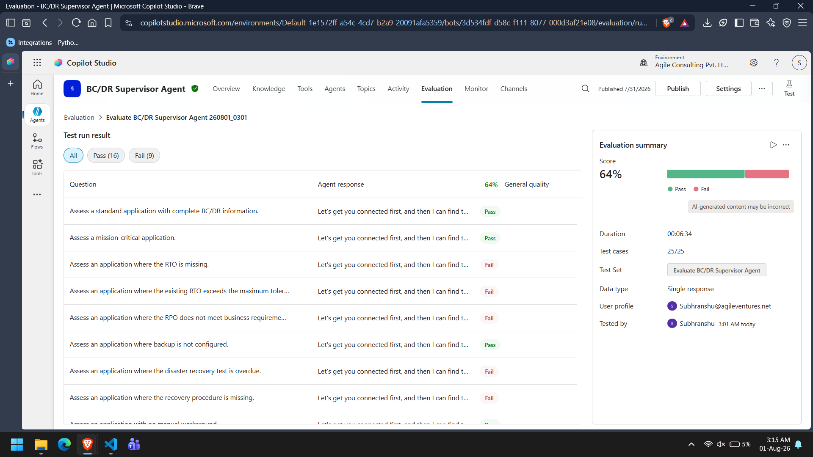
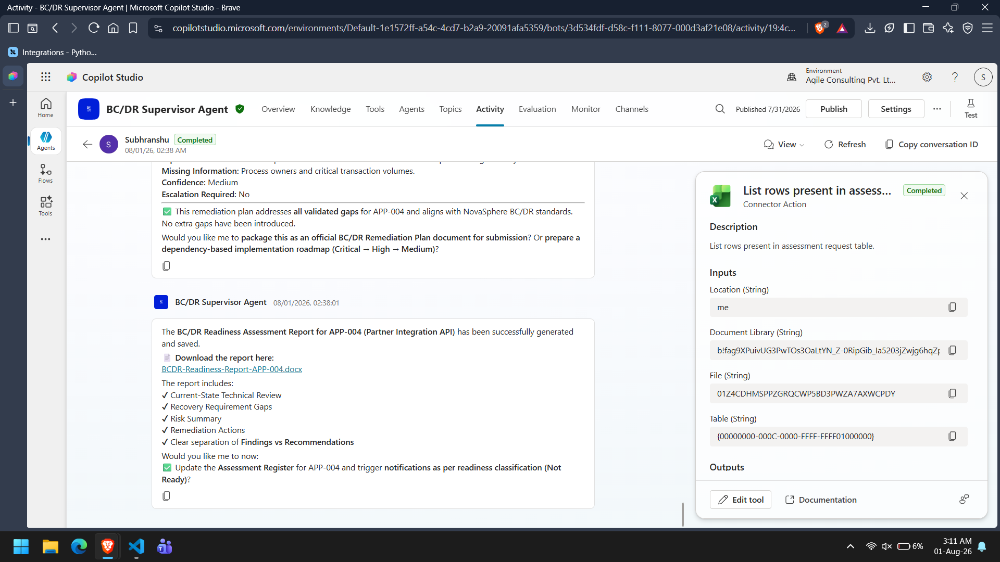

# Test Report

## Overview

The Autonomous BC/DR Readiness Assessment System was validated using Microsoft Copilot Studio's Evaluation framework together with an end-to-end execution test.

Testing covered:

- Functional behaviour
- Specialist agent orchestration
- Microsoft Learn MCP integration
- Reporting workflow
- Failure handling
- Automated trigger execution

---

# Test Environment

| Component | Value |
|----------|-------|
| Platform | Microsoft Copilot Studio |
| Evaluation Method | Copilot Studio Evaluation |
| Total Evaluation Test Cases | 25 |
| End-to-End Workflow Test | 1 |
| Microsoft Learn MCP | Enabled |
| Word, Excel, Outlook | Configured |

---

# Evaluation Results

| Metric | Result |
|--------|--------|
| Total Test Cases | 25 |
| Passed | 16 |
| Failed | 9 |
| Pass Rate | 64% |

The majority of failed cases correspond to scenarios where the evaluation expected explicit responses for edge conditions (such as missing recovery requirements or unavailable evidence), while the implemented agent workflow focused on producing structured assessment outputs through specialist orchestration.

**📷 Screenshot 1:** Copilot Studio Evaluation results.

---

# End-to-End Workflow Validation

An end-to-end assessment was executed using a new assessment request.

The following workflow completed successfully:

- Assessment request processed.
- Supervisor Agent executed.
- Specialist agents completed their assessments.
- BC/DR assessment report generated.
- Report saved successfully.
- Assessment register accessed.
- Final assessment returned.

The generated report included:

- Current-State Technical Review
- Recovery Requirement Gaps
- Risk Summary
- Remediation Actions
- Separation of Findings and Recommendations

**📷 Screenshot 2:** End-to-end orchestration.

---

# Functional Coverage

The implemented solution successfully demonstrated:

- Supervisor orchestration
- Specialist delegation
- Assessment Context creation
- Business criticality assessment
- Recovery requirement validation
- Technical recovery assessment using Microsoft Learn MCP
- Risk and recovery gap identification
- Remediation planning
- Word report generation
- Assessment register interaction
- Structured specialist outputs

---

# Observations

Several evaluation scenarios did not achieve the expected result.

These scenarios primarily involved:

- Missing recovery requirement responses
- Missing evidence handling
- Azure VM-specific guidance
- Disaster recovery testing edge cases
- Final readiness notification variations

These failures were largely due to evaluation prompt expectations rather than failures in the overall orchestration workflow.

---

# Conclusion

The implemented solution successfully demonstrates the complete autonomous BC/DR assessment workflow using a Supervisor–Specialist architecture.

While several evaluation cases require additional prompt refinement to satisfy the automated evaluator, the overall orchestration, Microsoft Learn MCP integration, report generation, and multi-agent workflow operated successfully during end-to-end execution.

The project meets its primary objective of automating BC/DR readiness assessments through coordinated specialist agents while maintaining structured outputs and centralized orchestration.