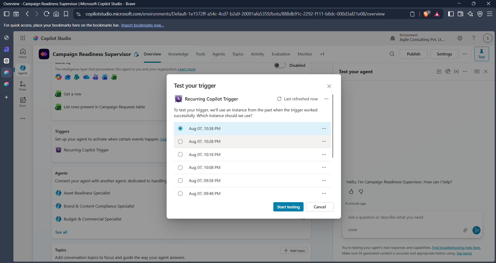

# Autonomous Trigger Design

## Purpose

The autonomous trigger initiates the Campaign Readiness Governance process without requiring a user conversation.

The trigger continuously monitors campaign intake records and automatically starts readiness assessments for campaigns awaiting review.

---

## Trigger Type

Recurring Trigger

Execution Mode:

- Autonomous
- Scheduled
- Unattended

---

## Schedule

Configured Recurrence:

- Frequency: Daily

The trigger runs once every day and checks the campaign request dataset for campaigns that are eligible for assessment.

---

## Trigger Workflow

### Step 1

Run recurrence schedule.

### Step 2

Sends a start query

### Step 3

Invoke:

Campaign Readiness Supervisor

### Step 4

Supervisor executes:

- Intake Ingestion
- Intake Validation
- Specialist Assessments
- Risk Assessment
- Approval Evaluation
- Remediation Handling
- Final Readiness Determination
- Reporting

---

## Design Rationale

A recurring autonomous trigger was selected because:

- Campaign requests arrive asynchronously
- Assessments must occur without user intervention
- PRD requires autonomous processing
- Multiple campaigns may arrive throughout the day which could lag system, so for security purpose it has been set to one day and may be modified later on as per need.

Daily execution provides sufficient responsiveness while minimizing unnecessary processing.

---

## Screenshot Reference

This screenshot shows:

- Recurrence configuration