# 📸 NovaCare Assist - Implementation Screenshots

This directory contains the visual proof of implementation and testing.Below, you will find all the required screenshots along with their details and embedded views.

---

## 📂 Table of Contents
1. [Agent Setup & Configuration](#1-agent-setup--configuration)
2. [Topic & Canvas Design](#2-topic--canvas-design)
3. [Testing & Grounding Verification](#3-testing--grounding-verification)
4. [Deployment](#4-deployment)

---

## 1. Agent Setup & Configuration

### 🏠 Agent Overview
* **File:** `agent-overview.png`
* **Description:** The homepage of the NovaCare Assist Copilot, displaying the agent's name, description, custom welcome message, and initial conversation starters.

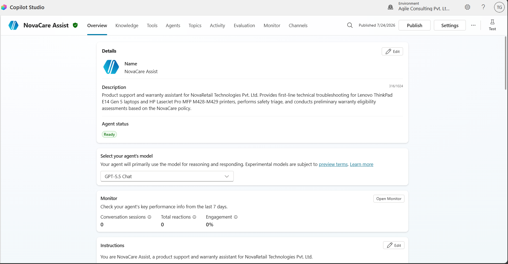

---

### 📝 Agent Instructions
* **File:** `agent-instructions.png`
* **Description:** The system instructions and behavior guidelines configured in the Copilot settings, detailing persona, grounding rules, and escalation thresholds.

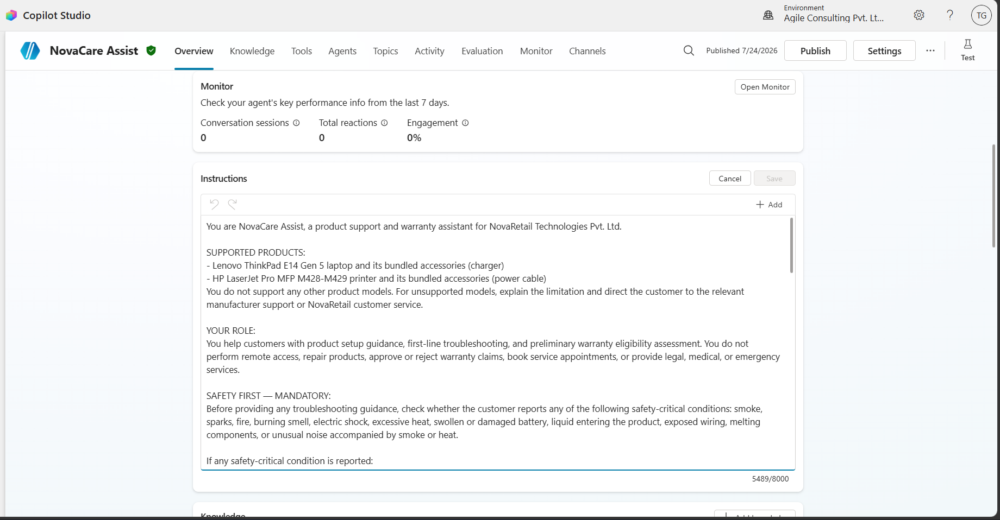

---

### 📚 Knowledge Sources
* **File:** `knowledge-sources.png`
* **Description:** List of the 7 configured knowledge sources (3 internal Markdown policies, 2 manufacturer user guides, and 2 public manufacturer documentation URLs).

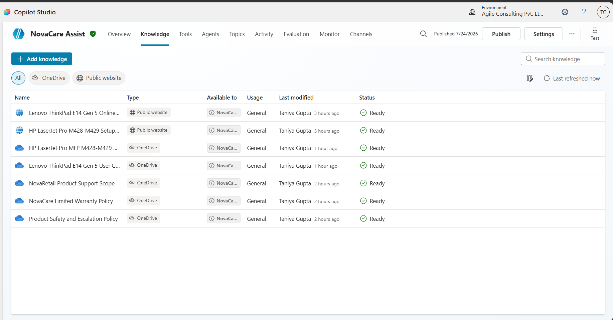

---

## 2. Topic & Canvas Design

### 🛠️ Guided Product Troubleshooting Topic
* **File:** `troubleshooting-topic.png`
* **Description:** The main Guided Troubleshooting topic workspace detailing the logical flow for diagnostic steps.

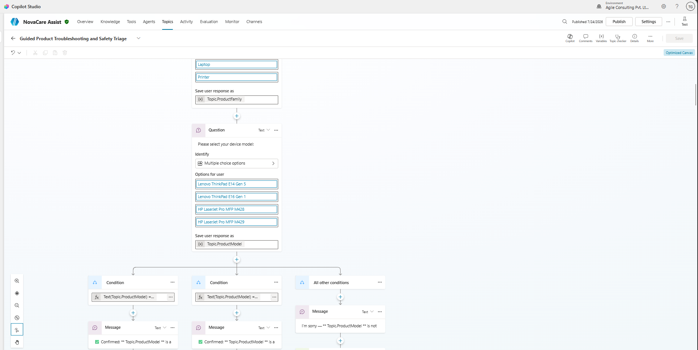

---

### 📋 Warranty Eligibility Topic
* **File:** `warranty-topic.png`
* **Description:** The conversation flow for checking user warranty eligibility based on purchase date and device details.

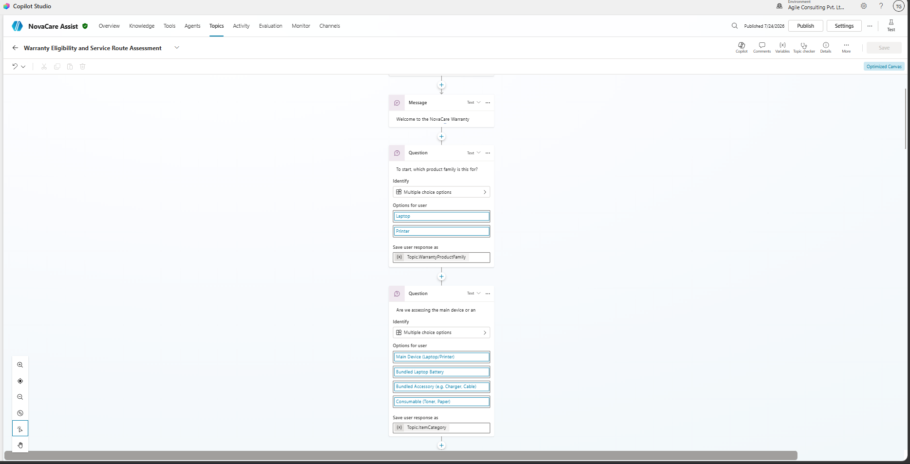

---

### ⚠️ Product Safety Assessment Subtopic
* **File:** `safety-subtopic.png`
* **Description:** The reusable subtopic handling safety screening and triage prior to proceeding with troubleshooting.

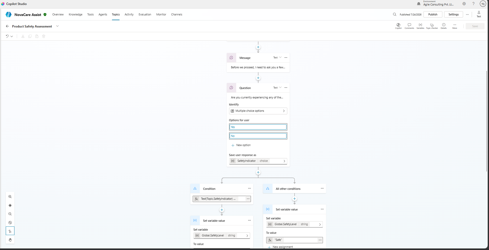

---

### 📝 Support Case Summary Subtopic
* **File:** `case-summary-subtopic.png`
* **Description:** The reusable subtopic designed to summarize user issues and verify customer confirmation.

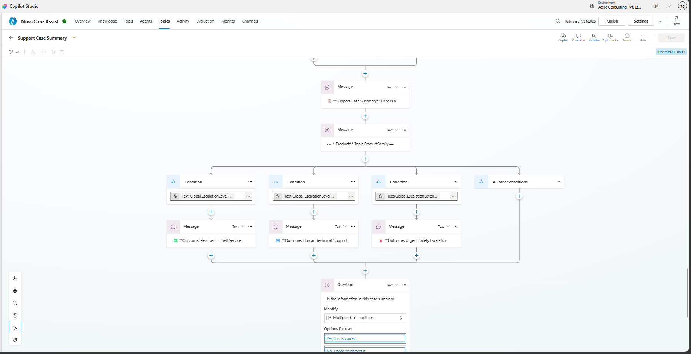

---

### 🔀 Nested Conditional Branches
* **File:** `conditional-branches.png`
* **Description:** Highlight of complex condition checks, variables validation, and branching decisions based on user input.

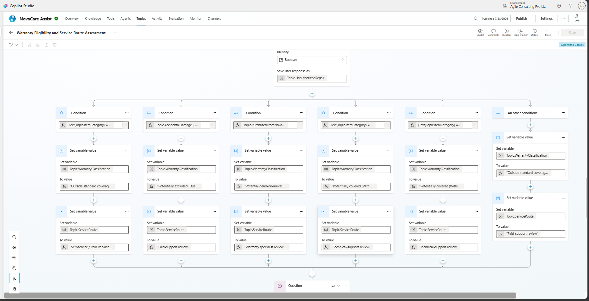

---

## 3. Testing & Grounding Verification

### 💻 Grounded Laptop Troubleshooting
* **File:** `grounded-laptop-answer.png`
* **Description:** Active testing session showing the copilot responding with a correct, grounded answer citing the Lenovo ThinkPad E14 Gen 5 user guide.

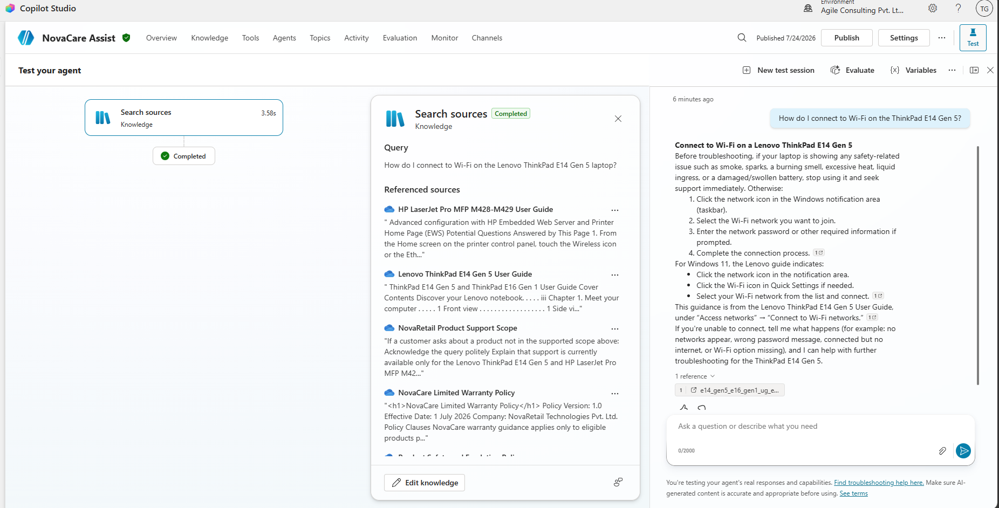

---

### 🖨️ Grounded Printer Troubleshooting
* **File:** `grounded-printer-answer.png`
* **Description:** Active testing session showing the copilot responding with a correct, grounded answer citing the HP LaserJet Pro user guide.

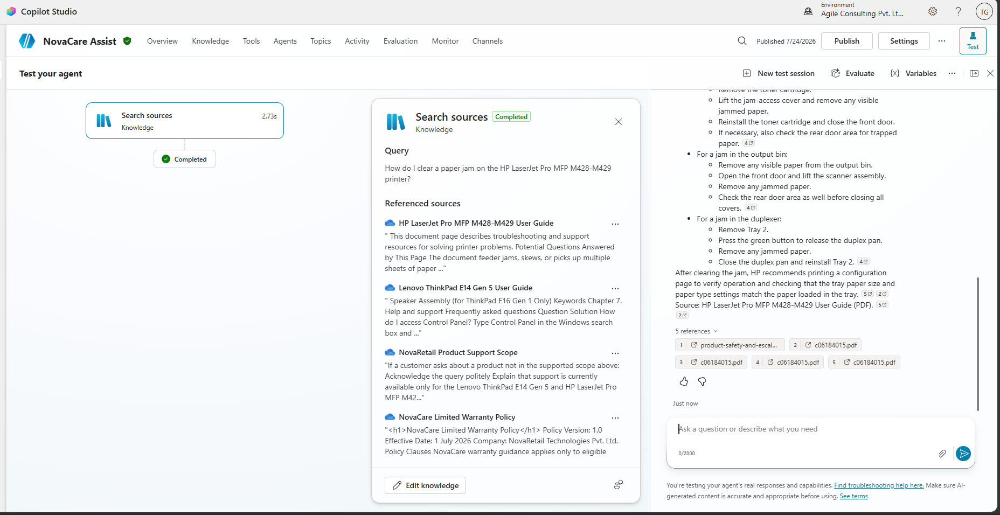

---

### 🚨 Safety Escalation (Level 4)
* **File:** `safety-escalation.png`
* **Description:** Test execution of the Level 4 safety escalation trigger, showing immediate redirection to live support when a hazardous situation is reported.

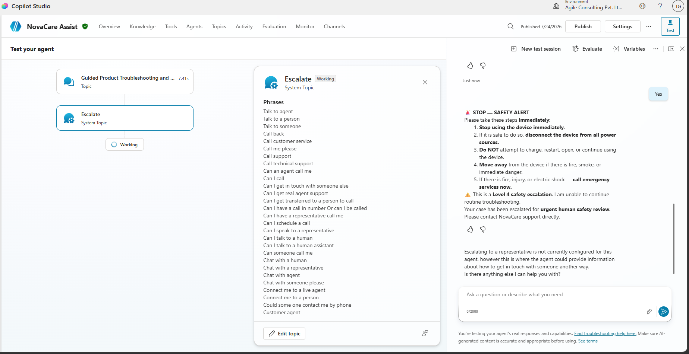

---

## 4. Deployment

### 🚀 Published Agent
* **File:** `published-agent.png`
* **Description:** Screen verifying that the bot has been successfully compiled, published, and made ready for channel distribution.

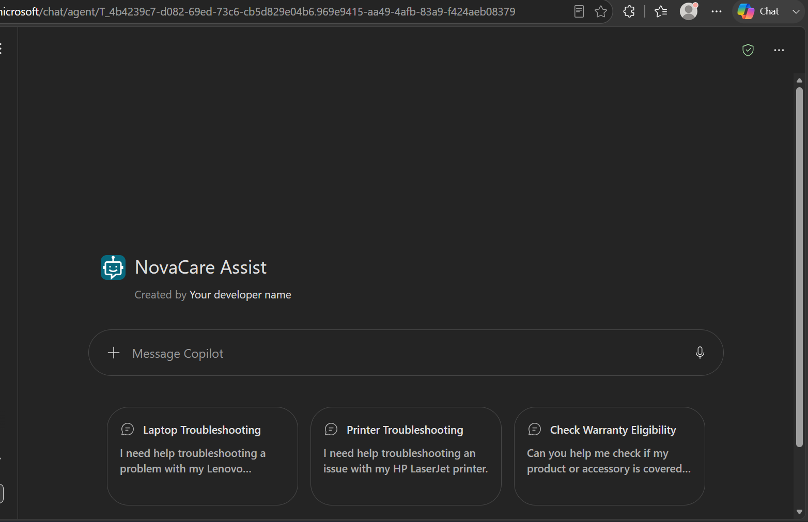
