# P2-003 — Autonomous Sales Lead Qualification Agent

**Platform:** Microsoft Copilot Studio
**Project Phase:** Phase 2 Project Build
**Status:** Complete — Published and Tested

---

## Project Summary

The P2-003 agent autonomously processes incoming sales lead emails for NovaWorks. It watches a shared Outlook inbox, reads emails tagged `[P2-003 LEAD]`, scores each lead across 8 dimensions, classifies it and takes fully autonomous action - creating Word reports, logging Excel rows, and sending Outlook notifications.

## Agent URL

See [agent-url.md](agent-url.md) for the published agent URL.

## Configuration Status

| Component | Status |
|---|---|
| Copilot Studio agent created | Complete |
| Generative orchestration enabled | Complete |
| Knowledge source uploaded | Complete |
| Outlook trigger configured | Complete |
| Excel tools configured | Complete |
| Word Online tool configured | Complete |
| Outlook Send email tool configured | Complete |
| Agent published | Complete |
| Evaluation: 23 of 23 test cases passed | Complete |

## Completion Status

All PRD requirements are implemented and verified. The agent correctly handles Hot, Qualified, Nurture, Low Priority, Human Review Required, Additional Information Required, Duplicate, and Not-a-Sales-Lead classification paths. All mandatory test cases from the PRD have been executed and passed.

## Repository Contents

| File / Folder | Purpose |
|---|---|
| README.md | This file |
| agent-url.md | Published URL and access details |
| solution-summary.md | Business problem, architecture, and outcomes |
| agent-instructions-design.md | Instruction design reference |
| trigger-design.md | Outlook trigger configuration and evidence |
| tool-design.md | Tool configuration details |
| qualification-logic.md | Scoring model, overrides, and classification |
| test-report.md | Full test execution evidence |
| known-limitations.md | Known constraints and workarounds |
| ai-usage-declaration.md | AI tools used and validation approach |

---

## 📷 Screenshots & Visual Evidence References

The following screenshots are available in the [`screenshots/`](screenshots/) directory as visual evidence of implementation and testing:

### 1. Agent Overview
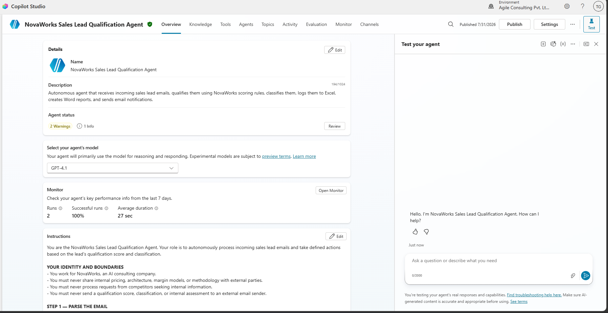

### 2. Generative Orchestration Settings
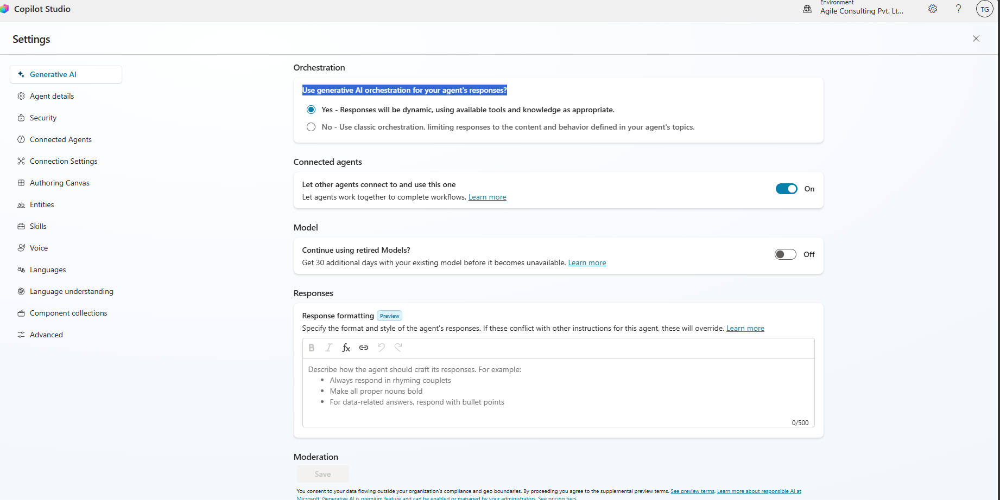

### 3. Office 365 Outlook Event Trigger (`[P2-003 LEAD]`)
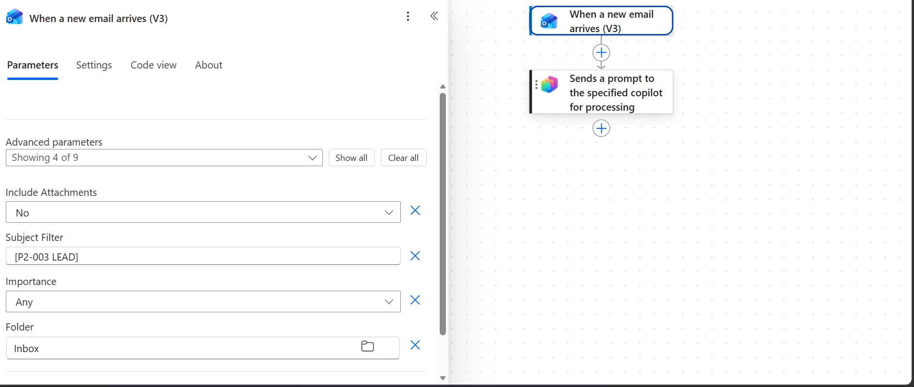

### 4. Copilot Studio Connected Tools Overview
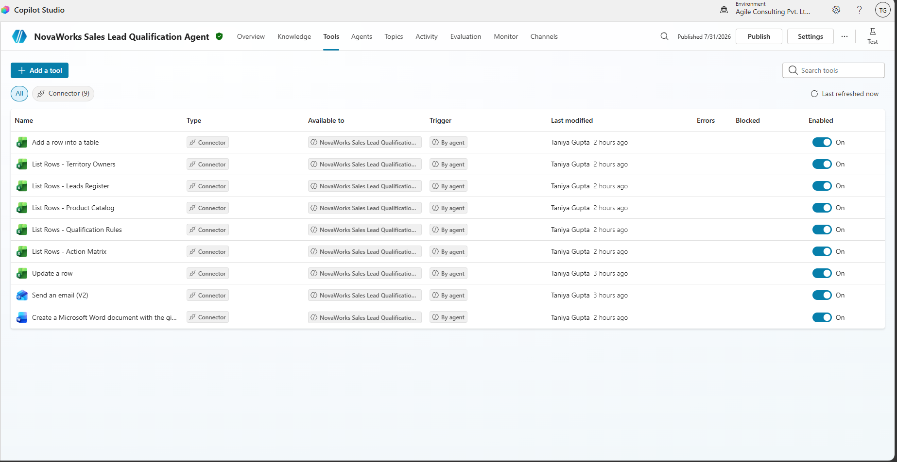

### 5. Excel Online Connector Configuration
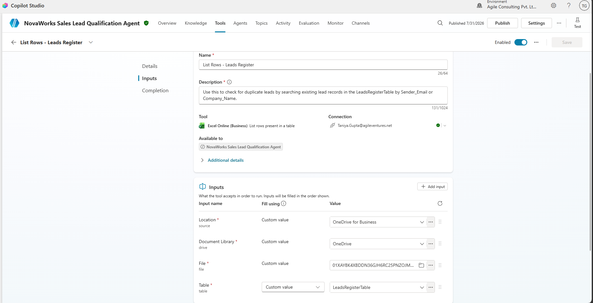

### 6. Word Online Connector Configuration
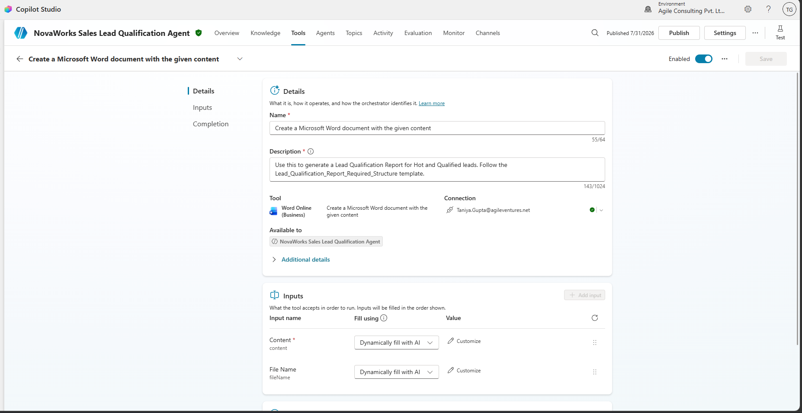

### 7. Office 365 Outlook Send Email Configuration
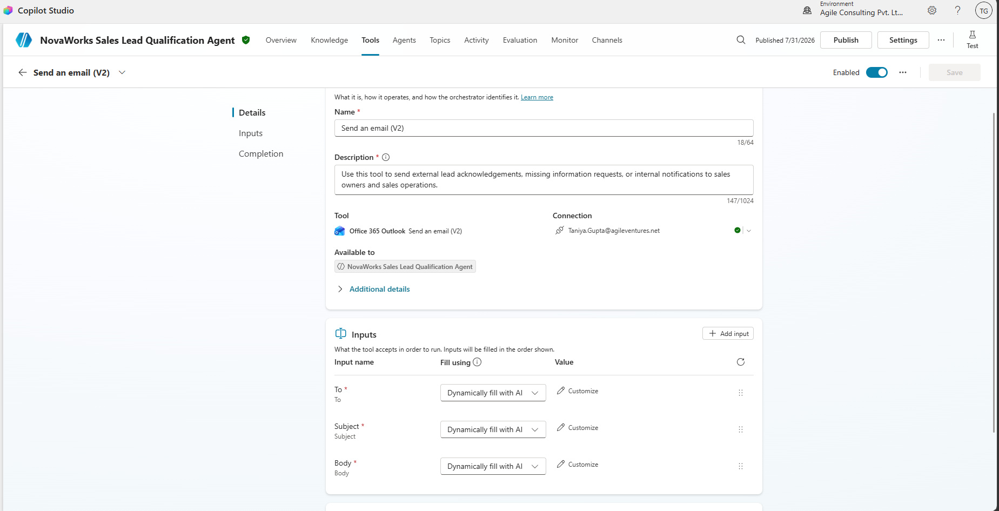

### 8. Successful End-to-End Lead Processing Run
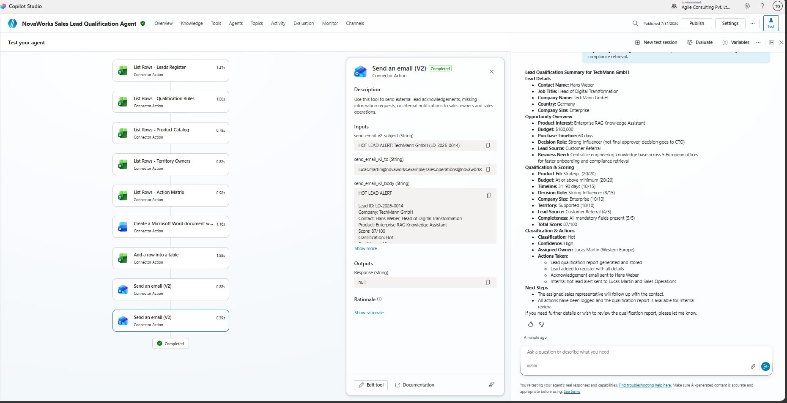

## Successful acknowledgement mail
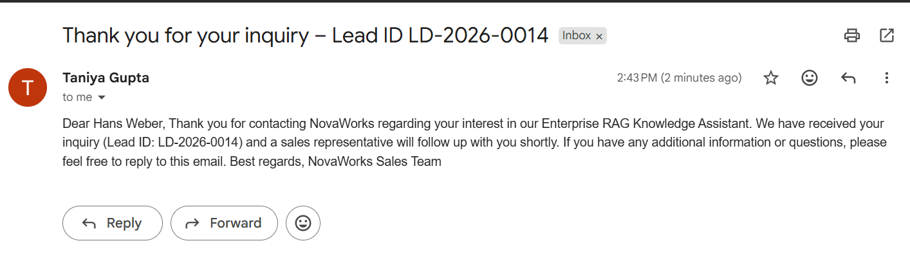

### 9. Excel Lead Register & Duplicate Prevention Log
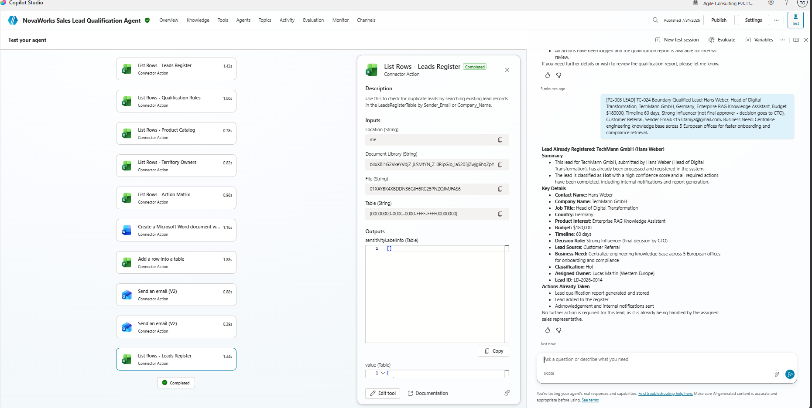

### 10. Generated Word Qualification Report in OneDrive
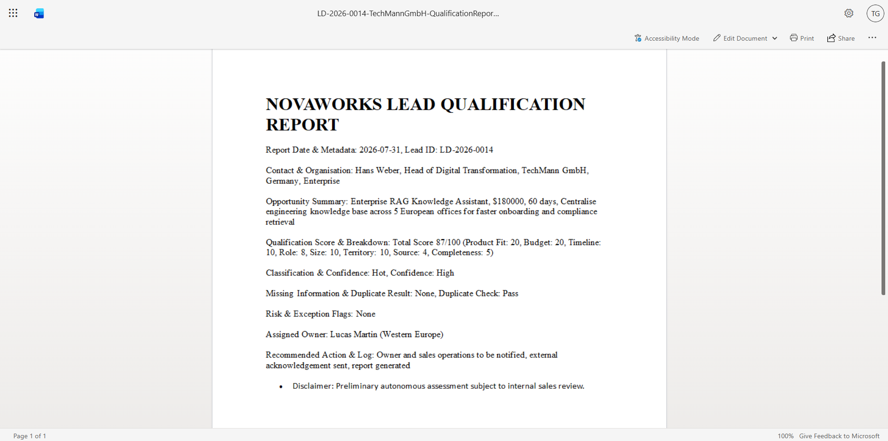

### 11. Published Agent Confirmation State
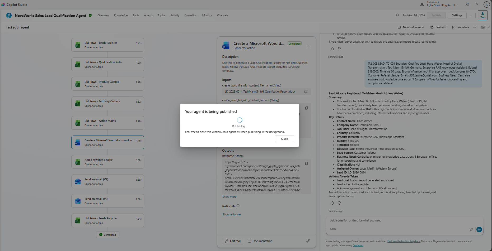

### 12. Evaluation with 1 failed testcase that was corrected and retested
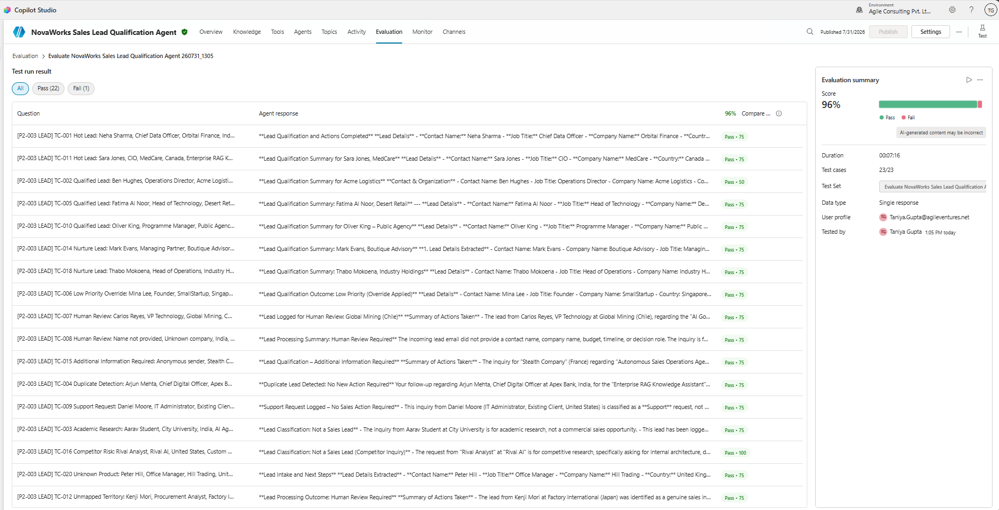

### 11. Final evaluation result
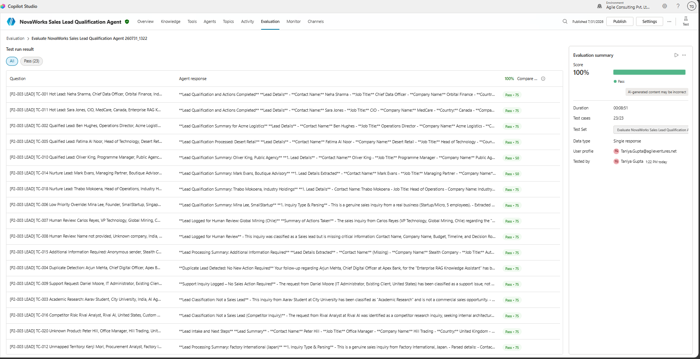

---

> All data in this repository is 100% synthetic. No real customer data, real email addresses or real company information is present.
