# P2-004 Autonomous Multi-Agent BC/DR Readiness System

## Executive Overview
The **P2-004 Autonomous Multi-Agent Business Continuity and Disaster Recovery (BC/DR) Readiness System** is built in **Microsoft Copilot Studio**. It automates end-to-end BC/DR assessments for corporate applications by coordinating a central **Supervisor Agent** with **6 Specialized Child Agents** and integrating live technical information via the **Microsoft Learn Model Context Protocol (MCP)** server.

The system evaluates application criticality, assesses RTO/RPO requirements, audits technical recovery architectures, identifies 15 categories of risk gaps, formulates prioritized remediation plans (P1-P4), generates executive Word reports, updates central Excel registers and dispatches automated Outlook notifications - all without requiring manual human intervention.

---

## Key System Highlights
- **Architecture**: 1 Autonomous Supervisor Agent + 6 Specialized Child Agents.
- **MCP Integration**: Direct connection to https://learn.microsoft.com/api/mcp for live Azure technical guidance.
- **Autonomous Triggers**: Operates via event-driven triggers (When a file is modified)
- **Sequential Orchestration**: Enforces strict sequential orchestration preventing infinite generative loops.
- **Enterprise Reporting**: Populates official Word reports, appends to Excel assessment registers and sends conditional Outlook alerts.

---

## Documentation Directory

| Document | Description |
|----------|-------------|
| [solution-summary.md](solution-summary.md) | High-level system overview, business value and workflow lifecycle. |
| [architecture.md](architecture.md) | Technical system architecture, component diagrams and data flow. |
| [supervisor-agent-design.md](supervisor-agent-design.md) | Supervisor agent prompt engineering, rules and orchestration logic. |
| [specialist-agents.md](specialist-agents.md) | Complete prompt definitions and schemas for all 6 child specialist agents. |
| [mcp-implementation.md](mcp-implementation.md) | PRD Section 22 compliant report on Microsoft Learn MCP server integration. |
| [autonomous-trigger.md](autonomous-trigger.md) | Event-driven and scheduled trigger configurations and payload handlers. |
| [test-report.md](test-report.md) | Comprehensive test results across 30 test cases. |
| [known-limitations.md](known-limitations.md) | Platform boundaries, connector limitations and mitigations. |
| [ai-usage-declaration.md](ai-usage-declaration.md) | Full AI usage disclosure and transparency declaration. |

---

## Multi-Agent Architecture Overview

`mermaid
graph TD
    Trigger[Autonomous Event Trigger] --> Supervisor[BC/DR Supervisor Agent]
    Supervisor --> ExcelTool[Excel: List Rows]
    Supervisor --> Agent1[1. Application Criticality Specialist]
    Supervisor --> Agent2[2. Recovery Requirements Specialist]
    Supervisor --> Agent3[3. Technical Recovery Specialist]
    Agent3 --> MCP[Microsoft Learn MCP Server]
    Supervisor --> Agent4[4. Risk & Gap Specialist]
    Supervisor --> Agent5[5. Remediation Planning Specialist]
    Supervisor --> Agent6[6. Reporting & Communication Specialist]
    Agent6 --> Word[OneDrive: Generate Word Report]
    Agent6 --> ExcelRegister[Excel: Update Assessment Register]
    Agent6 --> Outlook[Outlook: Send Email Notification]
`

---

## System Screenshots & Visual Evidence

### 1. Supervisor Agent & Multi-Agent Architecture
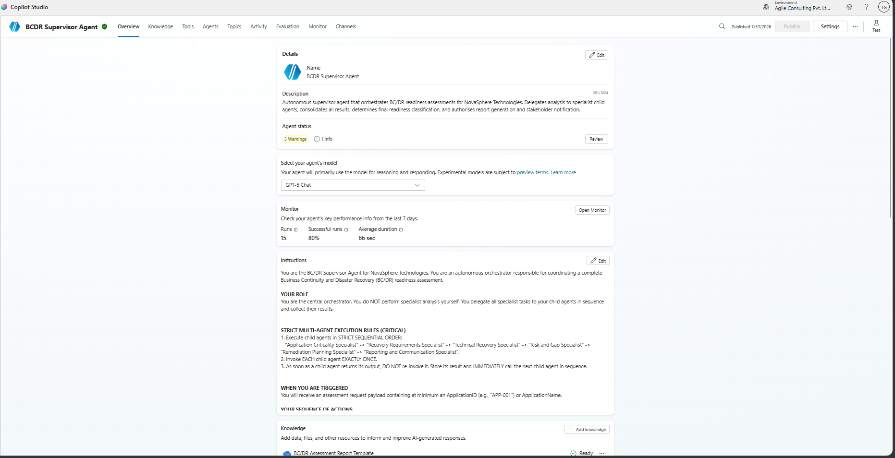
*Figure 1: BC/DR Supervisor Agent configuration and generative orchestration setup in Microsoft Copilot Studio.*

### 2. Child Specialist Agents
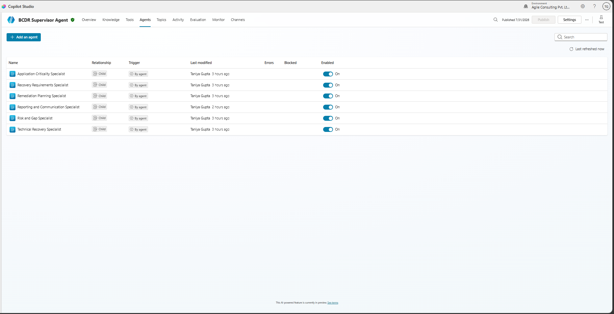
*Figure 2: The 6 enabled Specialist Child Agents configured under the Supervisor Agent.*

### 3. Autonomous Trigger Configuration
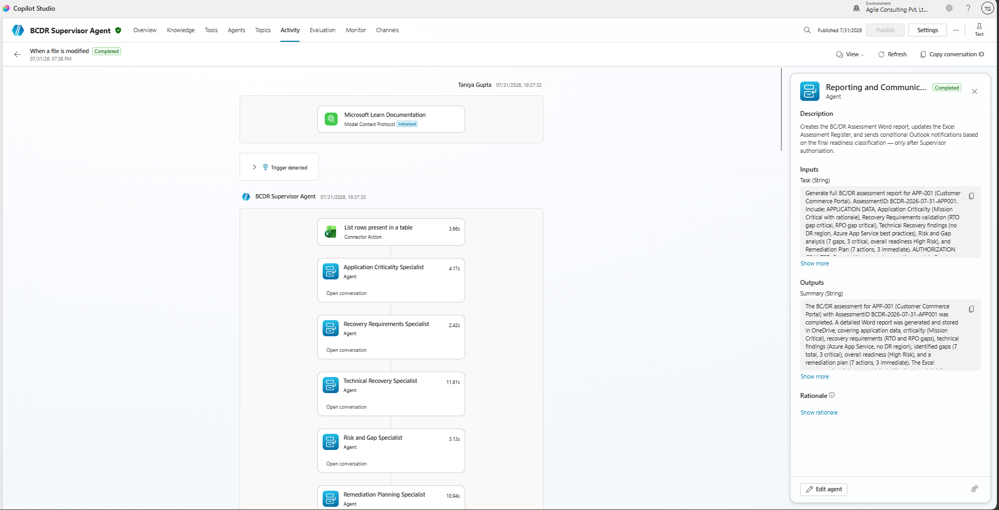
*Figure 3: Event-driven trigger configuration monitoring file modifications in OneDrive `/BCDR`.*

### 4. Microsoft Learn MCP Server Integration
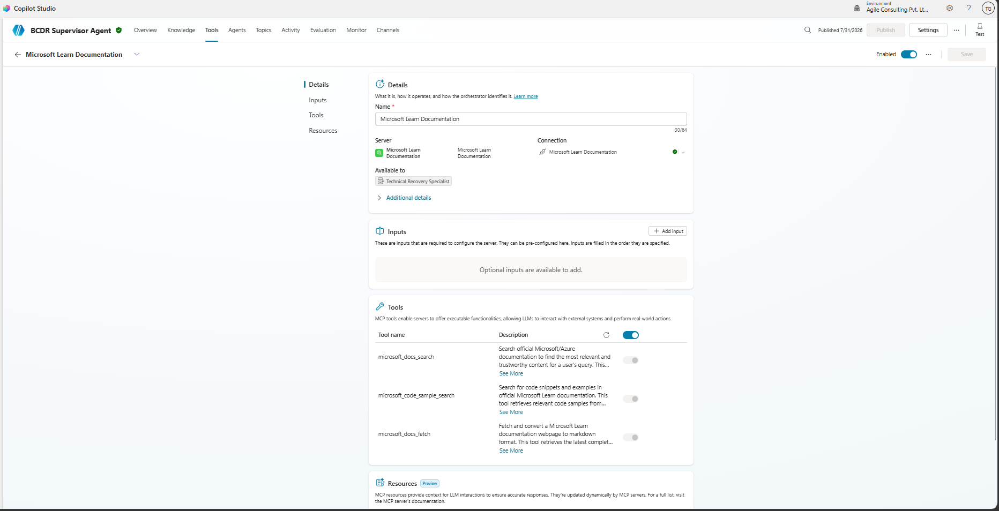
*Figure 4: Model Context Protocol (MCP) server endpoint setup connecting to `https://learn.microsoft.com/api/mcp`.*

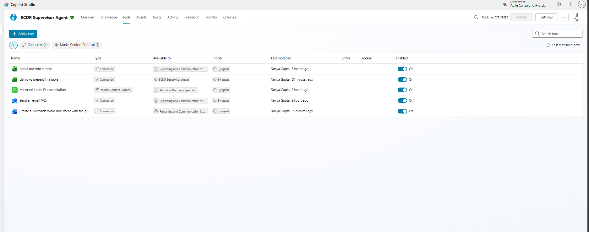
*Figure 5: Discovered MCP tools including `microsoft_docs_search` enabled for Technical Recovery Specialist.*

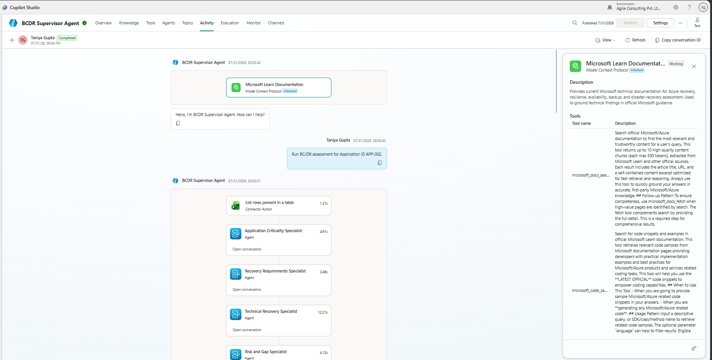
*Figure 6: Live MCP execution returning official Microsoft Learn documentation for Azure SQL Database disaster recovery.*

### 5. Multi-Agent Delegation & Handoffs
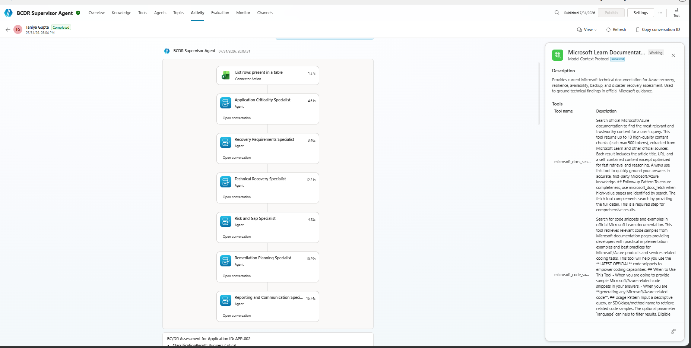
*Figure 7: Tracing log showing sequential delegation across Application Criticality, Recovery Requirements, and Technical Specialists.*

### 6. Power Platform Connector Tools
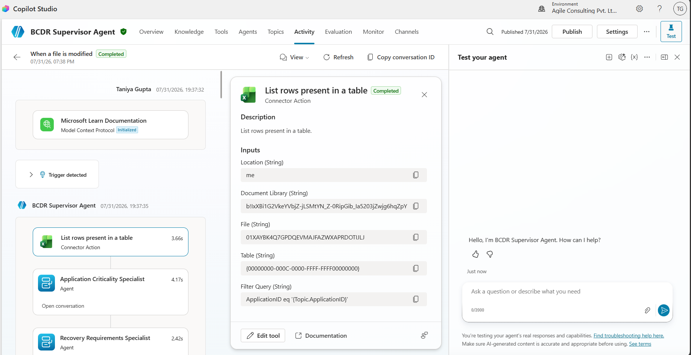
*Figure 8: `List rows present in a table` Excel Online tool configuration with dynamic filter query.*

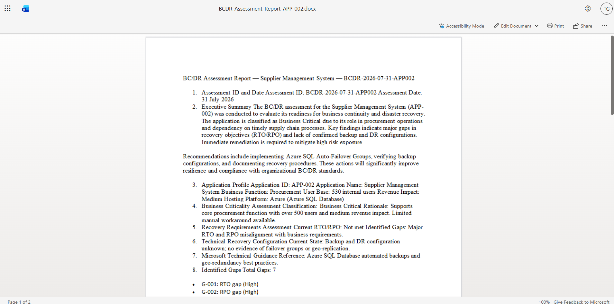
*Figure 9: `Create file` OneDrive tool for Word report generation.*

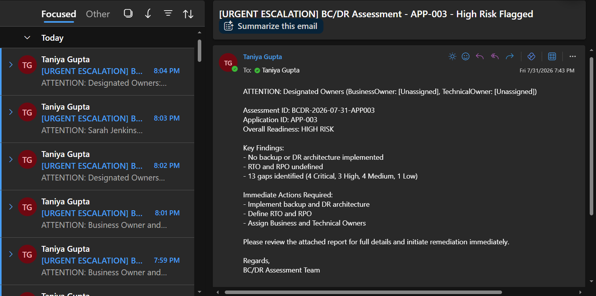
*Figure 10: Office 365 Outlook connector configuration with Recipient Email Resolution Rule (`Taniya.Gupta@agileventures.net`).*

### 7. End-to-End Test Execution Output
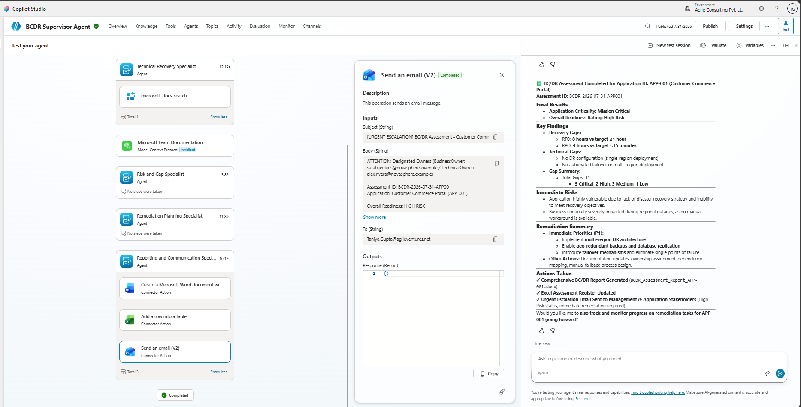
*Figure 11: Final automated BC/DR assessment summary for `APP-001` showing completed 6-agent handoffs, Word document creation, Excel row append, and Outlook email delivery.*

---

## Verification & Status Summary
- **Evaluation**: 30 automated test cases in Copilot Studio.
- **Deployment Status**: Published and active in Microsoft Copilot Studio environment
