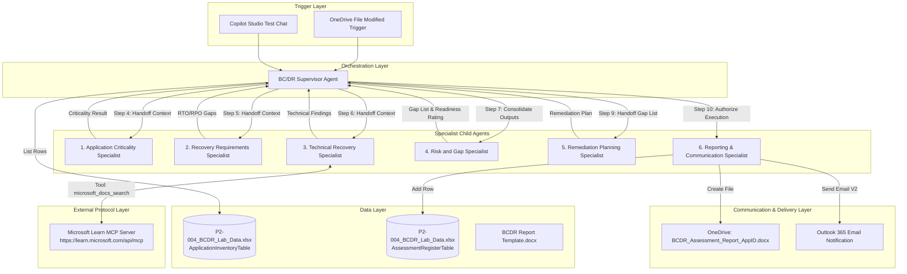

# System Architecture (`architecture.md`)

## High-Level Architecture

The **P2-004 Autonomous Multi-Agent BC/DR Readiness System** is built on **Microsoft Copilot Studio**. A single **Supervisor Agent** coordinates a pipeline of **6 Child Specialist Agents**, external data stores and an external Model Context Protocol (MCP) server.

---

## Error Handling & Resiliency Patterns

- **Dynamic Filter Pre-fill**: Prevents Copilot Studio from prompting the user for input during automated runs.
- **MCP Fallback**: If MCP is unreachable, Child Agent 3 sets `MCPEvidenceStatus = "Unavailable"` and continues assessment without breaking the pipeline.
- **Synthetic Email Resolver**: Maps synthetic `.example` domains in sample data to active Microsoft 365 user `Taniya.Gupta@agileventures.net` while retaining owner names in body.
- **Sequential Execution Lock**: Explicit instructions force single-pass execution of child agents to prevent generative retry loops.
