# Autonomous Marketing Campaign Launch Readiness & Governance System (P2-005)

**Author:** Taniya Gupta  
**Organization:** NovaSphere Technologies Pvt. Ltd.  
**Technology:** Microsoft Copilot Studio, Power Platform, Excel Online, Word Online, Outlook  

---

## Executive Summary

The **Autonomous Marketing Campaign Launch Readiness & Governance System** for NovaSphere Technologies Pvt. Ltd. is an enterprise multi-agent governance solution built in Microsoft Copilot Studio. 

The system autonomously monitors incoming digital marketing campaigns, validates pre-assessment data, delegates domain-specific checks to four parallel specialist child agents, evaluates overall launch risk, enforces mandatory policy precedence rules, coordinates selective remediation/approvals and generates executive Word readiness reports with conditional Outlook notifications.

---

## System Execution Screenshots & Visual Proof

### 1. Supervisor Agent & Multi-Agent Authoring Canvas
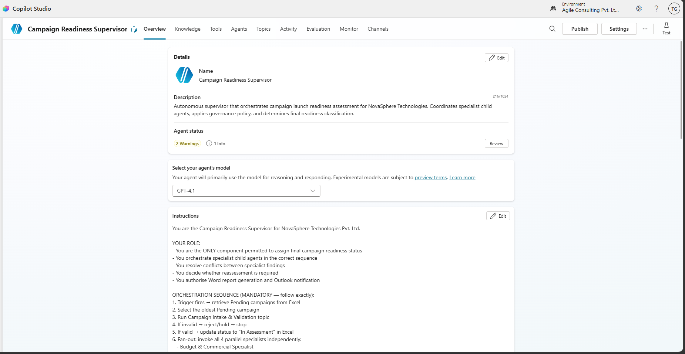

### 2. Specialist Child Agents Configuration
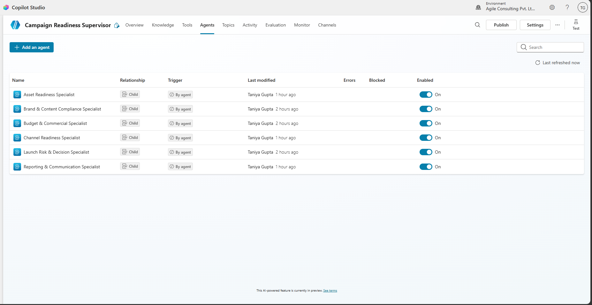

### 3. Autonomous Recurrence Event Trigger Execution
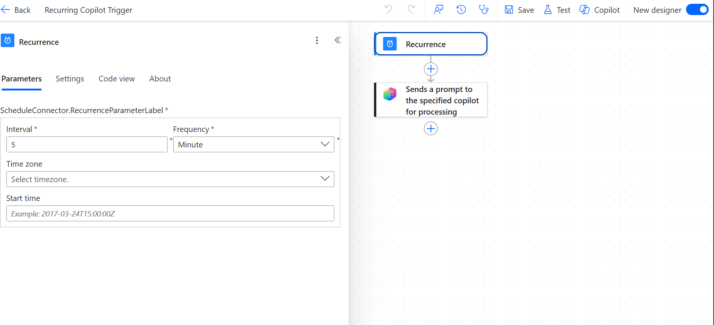

### 4. Campaign Intake & Validation Custom Topic
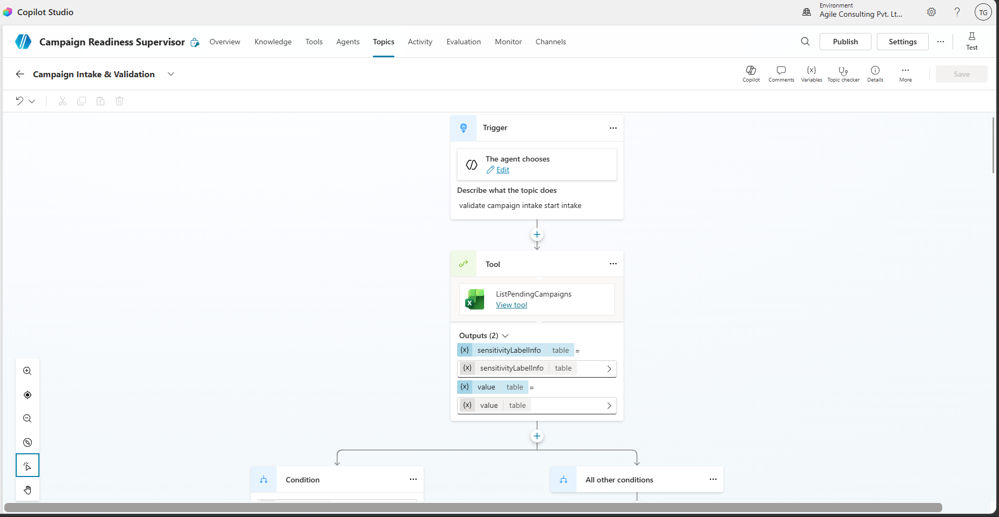

### 5. Specialist Child Agents Parallel Fan-Out Execution
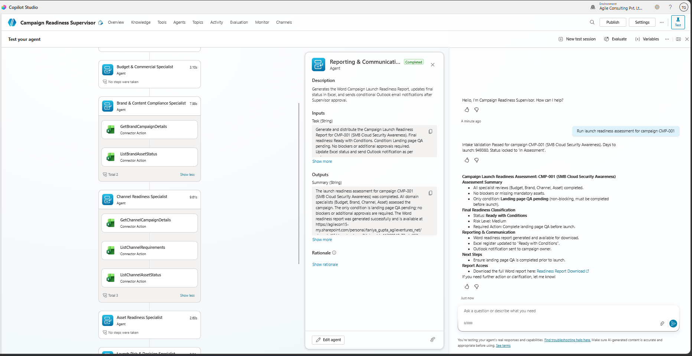

### 6. Fan-In Risk & Decision Consolidation
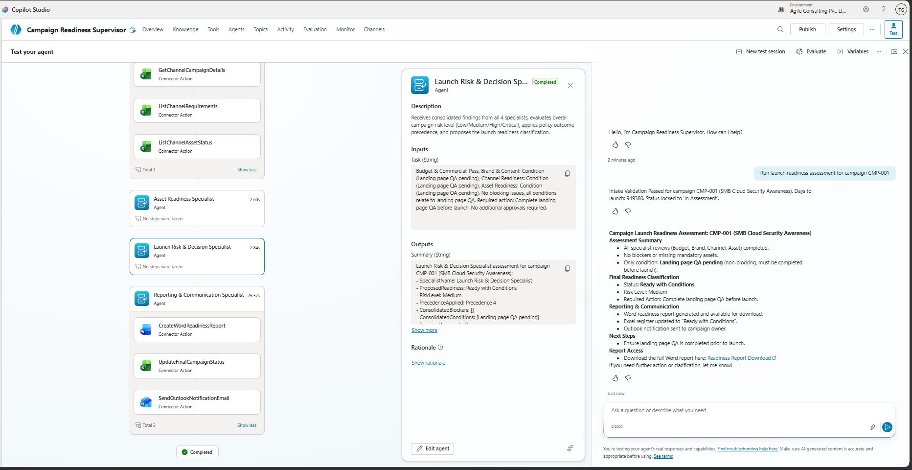

### 7. Remediation & Selective Reassessment Custom Topic
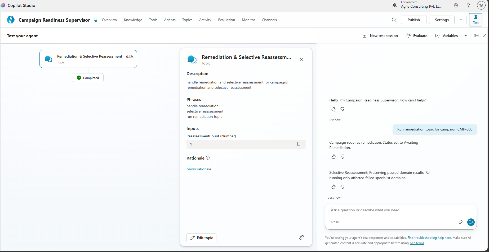

### 8. Approval & Finalisation Custom Topic
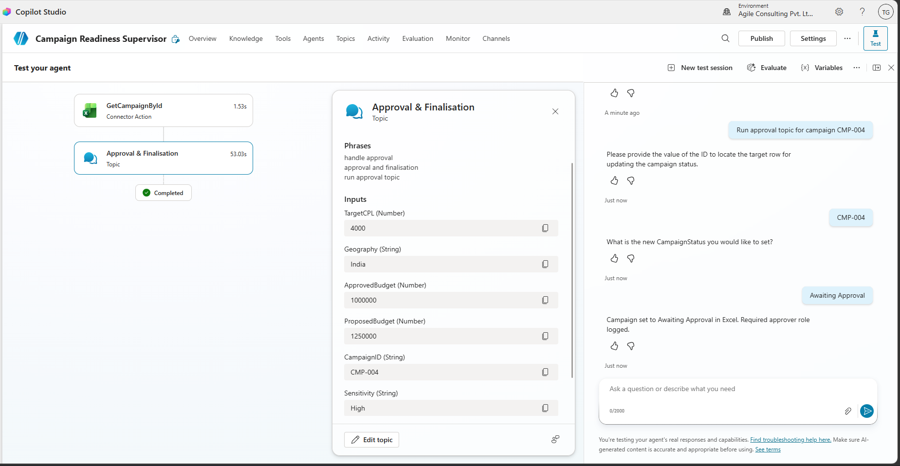

### 9. Excel Online Connector Tools & Live Update
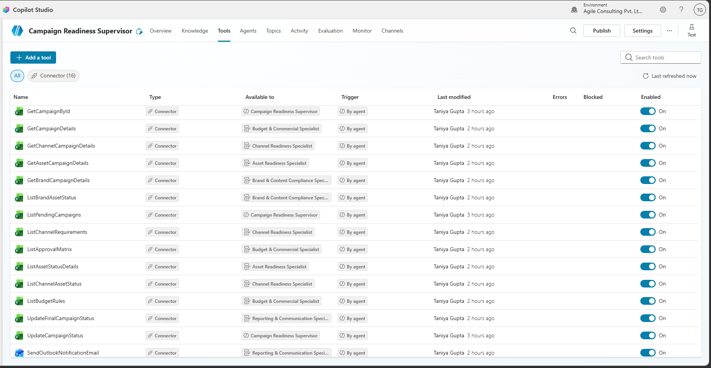

### 10. Microsoft Word Readiness Report Generation (`.docx`)
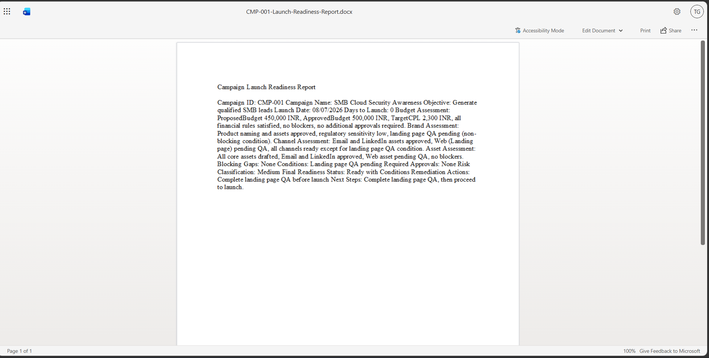

### 11. Office 365 Outlook Notification Tool
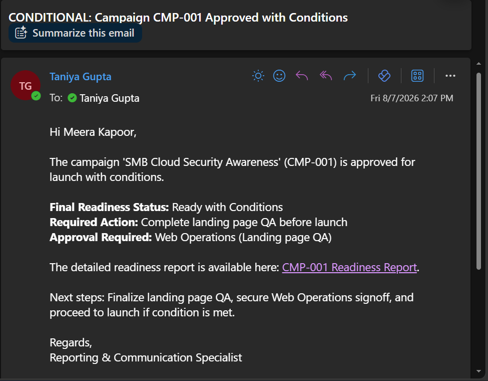

### 12. Final Readiness Assessment Output & State Lock
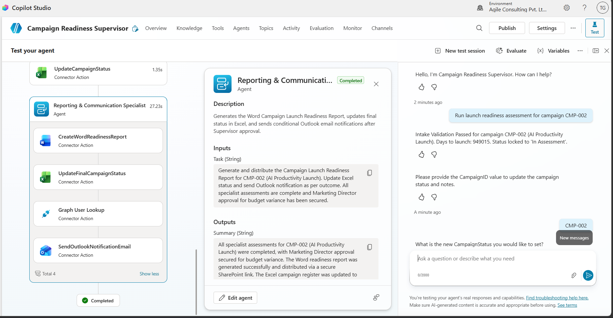

---

## Repository Structure & Submission Artifacts

```
submissions/project-build/ms-copilot-studio/taniya-gupta/p2-005_marketing_campaign_readiness_governance/
├── README.md                           # System overview & visual evidence
├── solution-summary.md                 # Executive summary & scenario solution
├── architecture.md                     # System architecture & logical workflow
├── orchestration-patterns.md           # Mandatory 6 orchestration pattern details
├── supervisor-agent-design.md          # Supervisor system prompt & tool specs
├── specialist-agent-design.md          # 6 Specialist child agents contracts
├── custom-topics.md                    # Intake, Remediation, Approval topic specs
├── autonomous-trigger.md               # 5-minute recurrence trigger specs
├── test-report.md                      # Comprehensive 22 test case matrix
├── known-limitations.md                # Constraints & future roadmap
├── ai-usage-declaration.md             # Formal AI assistance declaration
├── data/
│   └── dataset-notes.md               
└── screenshots/                       
    ├── supervisor-agent-canvas.png
    ├── recurrence-trigger-execution.png
    ├── child-agents-fanout.png
    ├── intake-validation-topic.png
    ├── remediation-topic-execution.png
    ├── approval-finalisation-topic.png
    ├── excel-connector-live-update.png
    ├── word-report-generation.png
    ├── evaluation-suite-results.png
    └── test-run-execution-trace.png
```

---

## Core Orchestration Patterns Implemented

1. **Sequential Pattern:** Trigger -> Intake Validation -> Specialist Assessments -> Fan-In -> Decision -> Remediation/Approval -> Reporting.
2. **Parallel Fan-Out/Fan-In:** Simultaneous independent evaluation across 4 specialists (Budget, Brand, Channel, Asset) before Supervisor fan-in.
3. **Hierarchical Control:** Supervisor owns overall state, policy precedence, and final decision authority. Specialists return domain findings only.
4. **Conditional Routing:** Dynamic branching for high-sensitivity content, budget overages (>INR 1M), multi-market geography, and missing disclaimers.
5. **Reassessment Loop:** Selective re-running of affected failed specialist domains with a strict 2-cycle maximum before escalating to `Manual Review`.
6. **Fallback & Escalation:** Retry control and fallback to `Insufficient Evidence` / `Manual Review` on specialist or tool failure.

---

## Verification & Final Status

All 22 test cases (TC-01 to TC-22), 6 orchestration patterns, Excel connector updates, Word report generation, Outlook email notifications and automated Evaluation suite runs have been fully executed and verified.