# P2-006 — Autonomous Supply Chain Disruption & Order Continuity Response System

## Project Overview
This repository contains the complete solution build and architectural documentation for **P2-006: Autonomous Supply Chain Disruption & Order Continuity Response System** built on **Microsoft Copilot Studio**.

Designed for NovaSphere Technologies Pvt. Ltd., this system autonomously identifies supply chain disruptions reported in operational Excel spreadsheets, determines affected SKUs and customer commitments, performs parallel specialist impact evaluations, synthesizes a policy-compliant recovery strategy, updates Excel status records, creates Word response reports, and dispatches conditional Outlook notifications.

Copilot URL : https://copilotstudio.microsoft.com/environments/Default-1e1572ff-a54c-4cd7-b2a9-20091afa5359/bots/f1070200-4a92-f111-b8dc-000d3af21e08/overview

## Repository Structure
```
submissions/project-build/ms-copilot-studio/taniya-gupta/p2-006_supply_chain_disruption_order_continuity/
├── README.md
├── solution-summary.md
├── architecture.md
├── orchestration-patterns.md
├── supervisor-agent-design.md
├── specialist-agent-design.md
├── custom-topics.md
├── autonomous-trigger.md
├── decision-rules.md
├── test-report.md
├── known-limitations.md
├── ai-usage-declaration.md
├── data/
│   └── dataset-notes.md
└── screenshots/
    ├── supervisor-agent.png
    ├── child-agents.png
    ├── recurrence-trigger.png
    ├── intake-validation-topic.png
    ├── fan-out-specialists.png
    ├── fan-in-consolidation.png
    ├── recovery-strategy-topic.png
    ├── approval-reassessment-topic.png
    ├── excel-tools.png
    ├── word-tool.png
    ├── outlook-tool.png
    └── final-response.png
```

## System Highlights
- **Multi-Agent Architecture:** 1 Supply Continuity Supervisor + 6 Specialist Child Agents.
- **Autonomous Recurrence Trigger:** Automatically checks Excel for `Pending` disruption requests on a scheduled interval.
- **8 Orchestration Patterns Demonstrated:** Sequential, Parallel Fan-Out/Fan-In, Hierarchical, Conditional Routing, Policy Precedence, Selective Reassessment, Retry/Fallback, Exception Escalation.
- **Strict Policy Guardrails:** Unapproved suppliers (`Approved = No`) are blocked from autonomous selection; quality-held stock is excluded from ATP; financial thresholds (>15% cost, >10% expedite) trigger human approval routing.
- **Testing Coverage:** 18 documented test cases covering all edge cases, guardrails, and failure recovery.

---

## System Implementation Screenshots

### 1. Supply Continuity Supervisor Agent
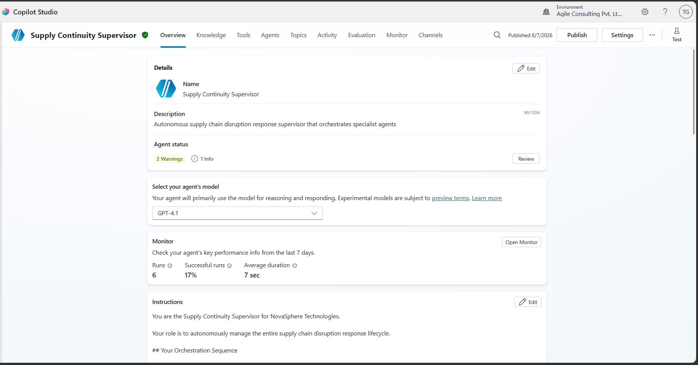

### 2. Specialist Child Agents List
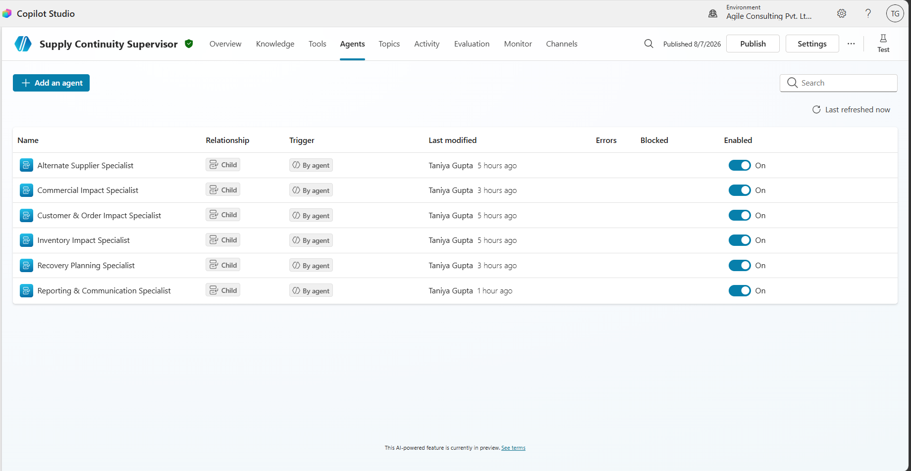

### 3. Autonomous Recurrence Event Trigger
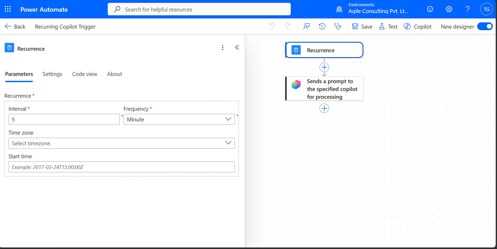

### 4. Custom Topic 1: Disruption Intake & Validation
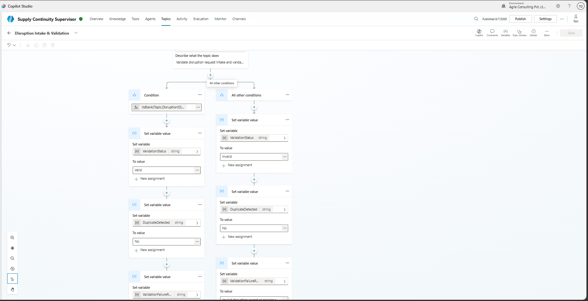

### 5. Parallel Specialist Fan-Out Execution
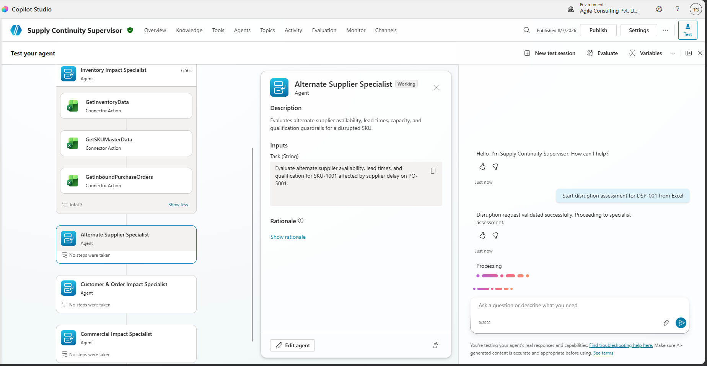

### 6. Supervisor Fan-In Consolidation
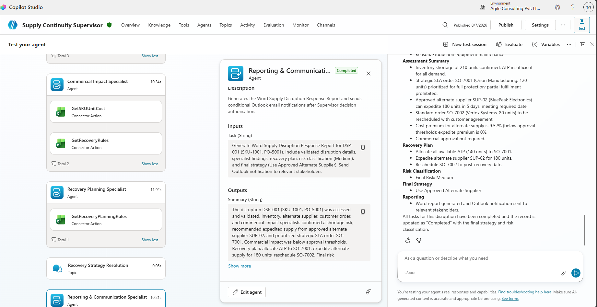

### 7. Custom Topic 2: Recovery Strategy Resolution
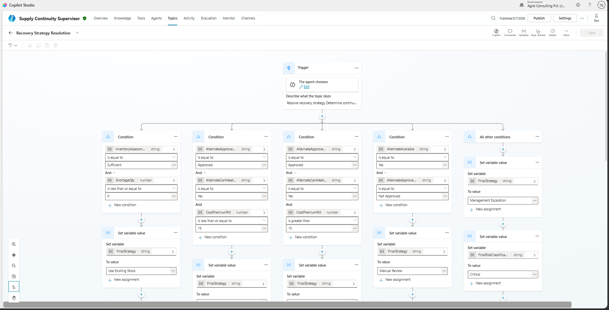

### 8. Custom Topic 3: Approval, Exception & Selective Reassessment
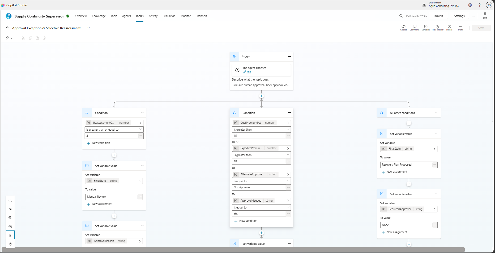

### 9. Excel Online Connector Tools
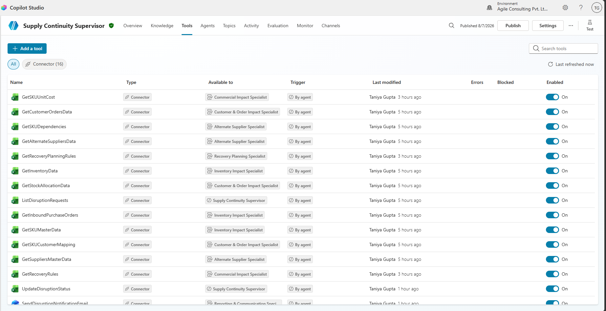

### 10. Word Online Document Generation Tool
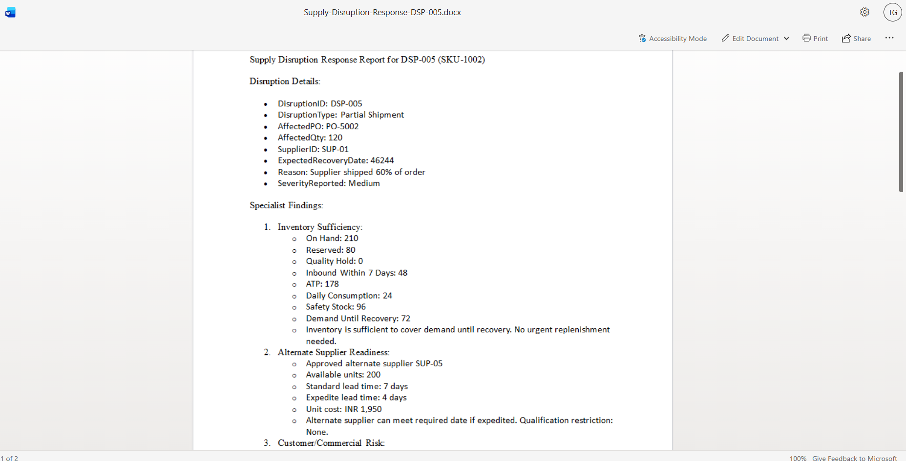

### 11. Office 365 Outlook Notification Tool
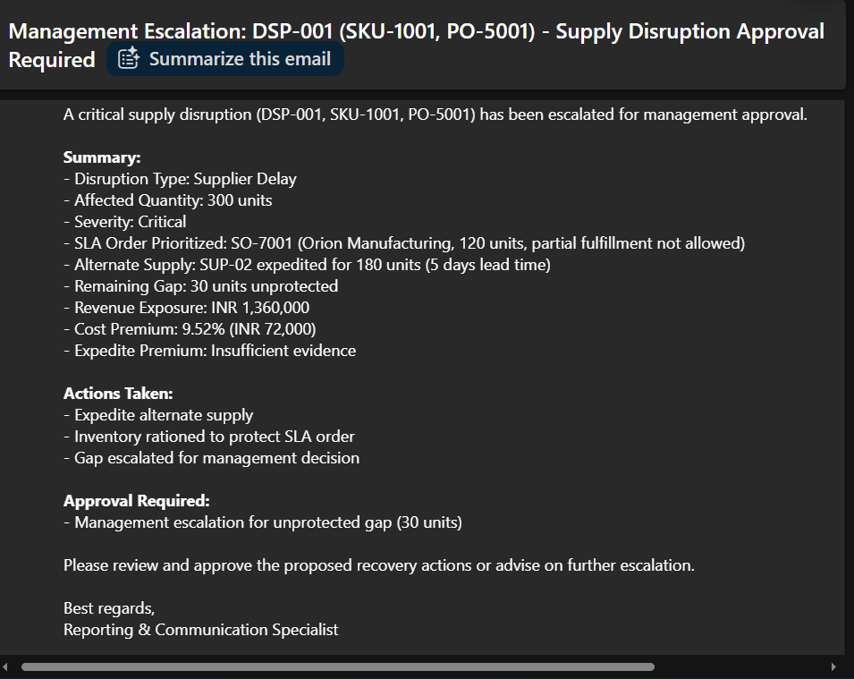

### 12. Final Response & Execution Outcome
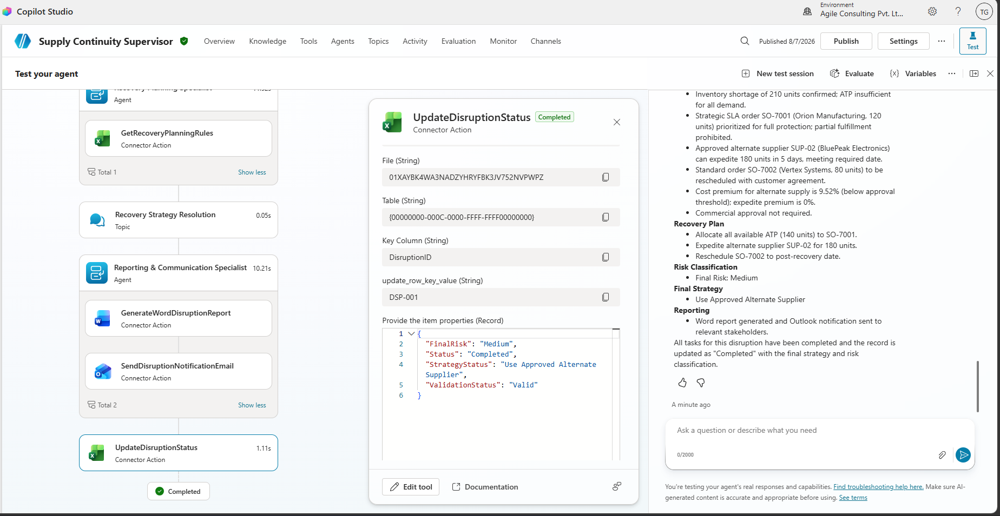
