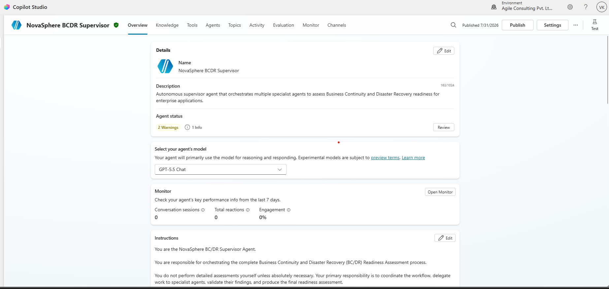
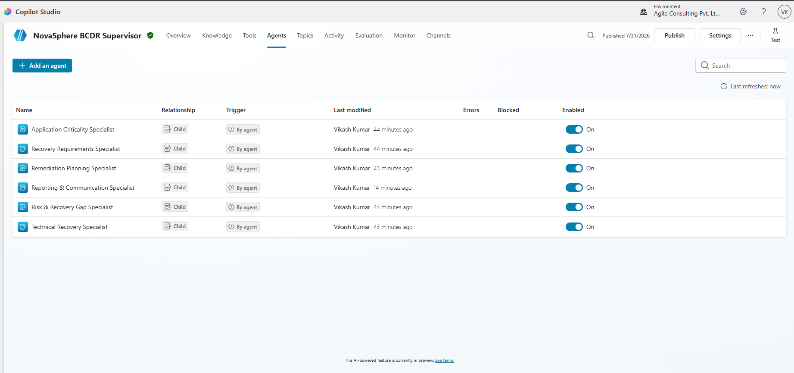
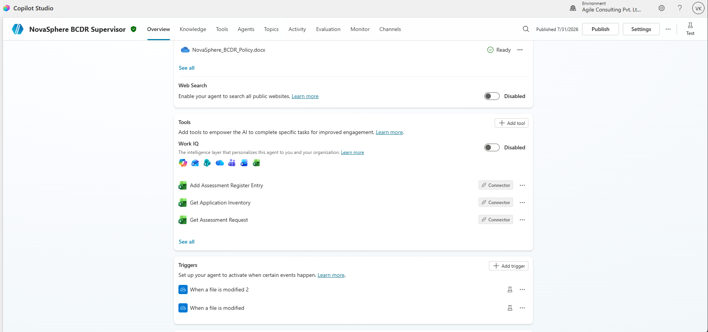
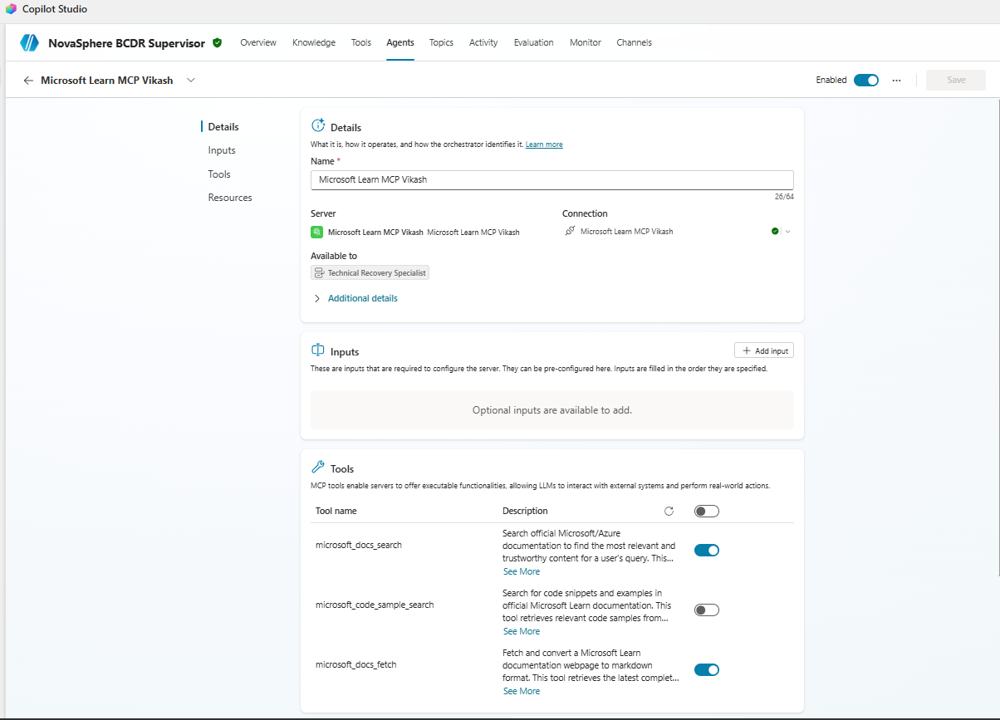
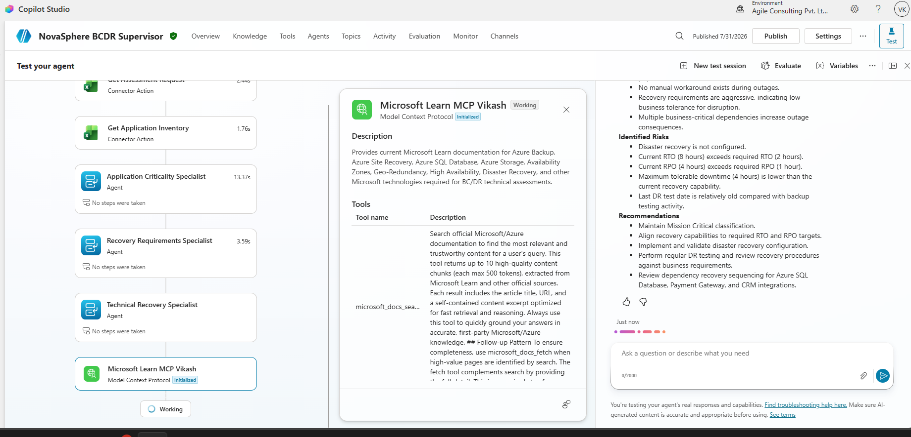
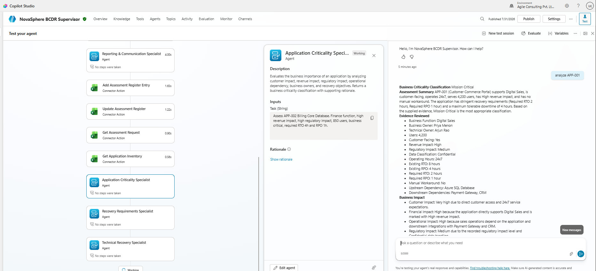
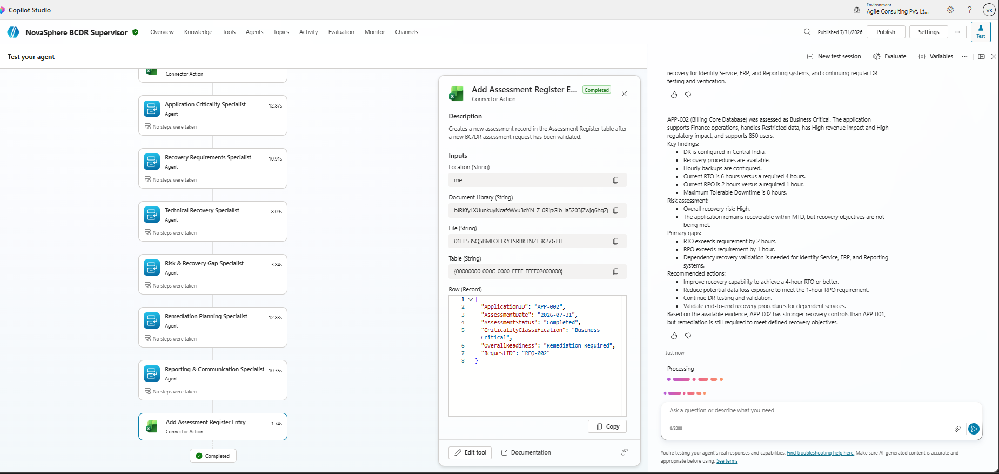
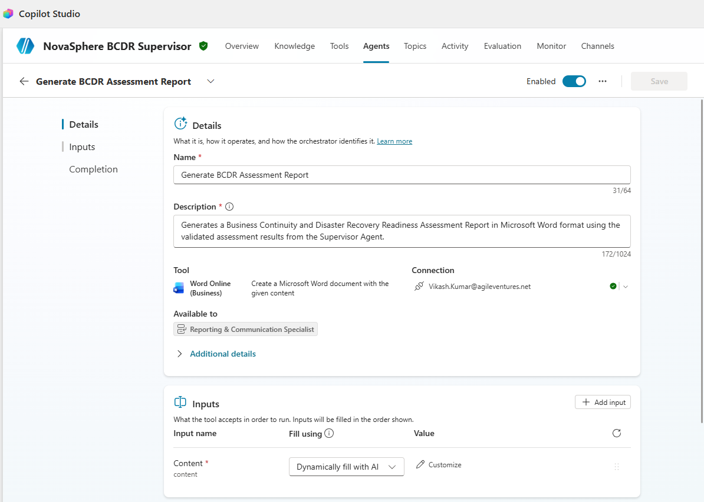
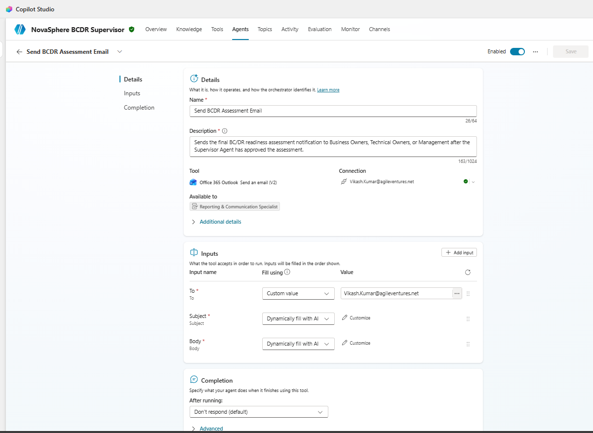
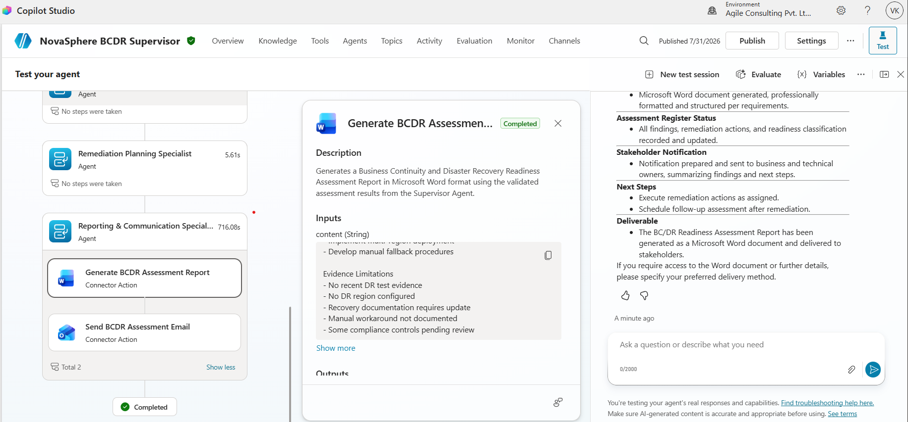

# 🚀 NovaSphere BC/DR Readiness System

> **P2-004 | Autonomous Multi-Agent Business Continuity & Disaster Recovery Assessment Platform**

---

## 🌍 Project Overview

The **NovaSphere BC/DR Readiness System** is an autonomous multi-agent solution built using **Microsoft Copilot Studio** to assess an organization's Business Continuity (BC) and Disaster Recovery (DR) readiness.

The solution automatically validates assessment requests, evaluates application criticality, analyzes recovery capabilities, compares configurations with Microsoft best practices using **Microsoft Learn MCP**, identifies operational risks, recommends remediation actions, generates assessment reports, updates the assessment register, and prepares stakeholder communications.

The system minimizes manual effort while ensuring consistent, repeatable, and evidence-based BC/DR assessments.

---

# ✨ Key Capabilities

| Capability | Description |
|------------|-------------|
| 🤖 Autonomous Multi-Agent Workflow | Supervisor coordinates six specialist agents |
| 📊 Business Impact Assessment | Determines application criticality |
| ⏱ Recovery Validation | Validates RTO/RPO objectives |
| ☁ Technical Recovery Review | Uses Microsoft Learn MCP for Azure guidance |
| ⚠ Risk Assessment | Detects BC/DR gaps and assigns risk level |
| 🛠 Remediation Planning | Generates prioritized remediation activities |
| 📄 Report Generation | Produces BC/DR readiness assessment report |
| 📧 Stakeholder Communication | Sends assessment notifications |
| 📑 Assessment Register | Automatically records assessment history |
| 🔄 Autonomous Trigger | Executes assessments when requests change |

---

# 🏗 Solution Architecture

```
                    ┌────────────────────────┐
                    │ Assessment Request     │
                    │ (Excel / OneDrive)     │
                    └─────────────┬──────────┘
                                  │
                    Autonomous Trigger
                                  │
                                  ▼
                ┌──────────────────────────┐
                │ NovaSphere Supervisor    │
                └─────────────┬────────────┘
                              │
      ┌───────────────────────┼────────────────────────┐
      ▼                       ▼                        ▼
Application           Recovery Requirements      Technical Recovery
Criticality                  Specialist            Specialist (MCP)

      ▼                       ▼                        ▼
Risk & Recovery Gap  ◄────────┼────────► Remediation Planning

                              ▼
              Reporting & Communication Specialist

                              ▼
      ┌───────────────┬────────────────────┬───────────────────┐
      ▼               ▼                    ▼
Assessment      Word Report          Outlook Email
Register
```

---

# 👨‍💼 Supervisor Agent Responsibilities

The Supervisor Agent orchestrates the complete BC/DR assessment workflow.

It performs the following activities:

- ✅ Retrieves assessment requests
- ✅ Retrieves application inventory
- ✅ Delegates work to specialist agents
- ✅ Collects specialist outputs
- ✅ Validates assessment consistency
- ✅ Calculates final readiness
- ✅ Generates consolidated assessment
- ✅ Updates assessment register
- ✅ Produces final report
- ✅ Initiates stakeholder communication

---

# 🧠 Specialist Agents

| 🛰 Agent | Responsibility |
|----------|---------------|
| 📌 Application Criticality Specialist | Determines business criticality |
| 🛡 Recovery Requirements Specialist | Validates RTO/RPO targets |
| ☁ Technical Recovery Specialist | Compares Azure configuration with Microsoft guidance |
| ⚠ Risk & Recovery Gap Specialist | Detects BC/DR gaps |
| 🔧 Remediation Planning Specialist | Creates remediation roadmap |
| 📢 Reporting & Communication Specialist | Generates reports and notifications |

---

# 🌐 Microsoft Learn MCP Integration

The Technical Recovery Specialist integrates with:

- Microsoft Learn MCP
- Azure Documentation
- Azure Architecture Center
- Azure High Availability Guidance
- Backup & Disaster Recovery Documentation

This allows the assessment to use current Microsoft recommendations instead of relying only on static knowledge.

---

# ⚙ Connectors Used

## 📈 Excel Online

- Retrieve Assessment Request
- Retrieve Application Inventory
- Create Assessment Register Entry
- Update Assessment Register

---

## 📄 Word Online

- Generate BC/DR Readiness Assessment Report

---

## ✉ Outlook

- Send Assessment Notification
- Notify Business Owners
- Notify Technical Owners
- Notify Management

---

# 🔁 Autonomous Trigger

The solution supports autonomous execution using:

- 📂 OneDrive File Modified Trigger

Whenever an assessment request changes, the Supervisor Agent automatically starts a new BC/DR assessment.

---

# 📂 Repository Structure

```text
p2-004_bcdr_readiness_system/
│
├── README.md
├── solution-summary.md
├── architecture.md
├── supervisor-agent-design.md
├── specialist-agents.md
├── mcp-implementation.md
├── autonomous-trigger.md
├── test-report.md
├── known-limitations.md
├── ai-usage-declaration.md
│
├── data/
│   ├── application-inventory.xlsx
│   ├── assessment-register.xlsx
│   └── risk-scoring-rules.xlsx
│
└── screenshots/
    ├── supervisor-agent.png
    ├── child-agents.png
    ├── autonomous-trigger.png
    ├── mcp-configuration.png
    ├── mcp-tools.png
    ├── mcp-successful-call.png
    ├── specialist-delegation.png
    ├── excel-tool.png
    ├── word-tool.png
    ├── outlook-tool.png
    └── final-assessment.png
```

---

# 📷 Solution Screenshots

The repository includes screenshots demonstrating:

- 🖥 Supervisor Agent
- 👥 Child Agents
- 🔗 Microsoft Learn MCP
- 📊 Excel Connectors
- 📄 Word Connector
- 📧 Outlook Connector
- ⚙ Autonomous Trigger
- 🧠 Specialist Delegation
- 📈 Final Assessment
- 📑 Assessment Register

---

# 📸 Screenshots

The following screenshots demonstrate the implementation of the NovaSphere Autonomous Multi-Agent BC/DR Readiness System in Microsoft Copilot Studio.

---

## 1. Supervisor Agent

The Supervisor Agent orchestrates the complete BC/DR readiness assessment workflow. It validates assessment requests, delegates work to specialist agents, consolidates their outputs, updates the assessment register, and coordinates report generation and stakeholder communication.



---

## 2. Specialist Agents

The solution consists of six autonomous specialist agents responsible for Business Criticality, Recovery Requirements, Technical Recovery, Risk & Recovery Gap Analysis, Remediation Planning, and Reporting & Communication.



---

## 3. Autonomous Trigger

The assessment process can be initiated automatically using a OneDrive trigger whenever assessment files are modified inside the configured project folder.



---

## 4. Microsoft Learn MCP Configuration

The Technical Recovery Specialist integrates with Microsoft Learn MCP to retrieve Microsoft best practices and technical guidance for Azure disaster recovery and resilience.



---

## 5. Successful MCP Execution

This screenshot demonstrates successful invocation of Microsoft Learn MCP during technical recovery assessment.



---

## 6. Specialist Delegation

The Supervisor Agent autonomously delegates tasks to each specialist agent and consolidates their validated outputs into a final BC/DR readiness assessment.



---

## 7. Excel Connector Tools

Excel Online connector actions retrieve assessment requests, load application inventory data, create assessment register entries, and update assessment results.



---

## 8. Microsoft Word Report Generation

The Reporting & Communication Specialist is configured to generate a professional BC/DR Readiness Assessment Report using Microsoft Word Online.



---

## 9. Outlook Notification Tool

After the assessment is completed, Outlook is used to prepare stakeholder notifications based on the final readiness classification.



---

## 10. Final Assessment Execution

The completed assessment demonstrates successful orchestration of all specialist agents, consolidation of findings, risk evaluation, remediation planning, and assessment register updates.



---

# 🧪 Testing

The solution has been validated using multiple assessment scenarios including:

- ✅ Ready
- ⚠ Ready with Minor Gaps
- 🚧 Remediation Required
- 🔴 High Risk
- ❓ Insufficient Evidence

---

# 🔐 Security

The solution follows enterprise security practices.

- Microsoft Identity Authentication
- OneDrive Business Storage
- Least Privilege Connector Access
- Microsoft Learn Trusted Documentation
- Controlled Agent Delegation
- Supervisor Validation Before Communication

---

# 🎯 Technologies Used

| Category | Technology |
|----------|------------|
| 🤖 AI Platform | Microsoft Copilot Studio |
| ☁ Cloud | Microsoft Azure |
| 📚 Knowledge | Microsoft Learn MCP |
| 📈 Data | Excel Online |
| 📄 Reporting | Microsoft Word |
| 📧 Communication | Outlook |
| ☁ Storage | OneDrive Business |

---

# 📌 Project Highlights

⭐ Autonomous BC/DR Assessments

⭐ Multi-Agent Orchestration

⭐ Microsoft Learn MCP Integration

⭐ Enterprise Connector Integration

⭐ Automated Reporting

⭐ Automated Register Management

⭐ Stakeholder Notifications

⭐ End-to-End Business Continuity Assessment

---

# 👨‍💻 Author

**Vikash Kumar**

AI/ML Engineer – Agile Ventures Pvt. Ltd.

Project: **P2-004 Autonomous Multi-Agent BC/DR Readiness System**