# 🚀 Campaign Readiness Supervisor

> **Microsoft Copilot Studio – Project P2-005**  
> Marketing Campaign Readiness Governance


---

# 📖 Overview

The **Campaign Readiness Supervisor** is an enterprise-grade multi-agent orchestration solution built using **Microsoft Copilot Studio**. The solution evaluates whether a marketing campaign is ready for launch by coordinating multiple AI specialist agents, validating campaign data, consolidating assessment results, and producing a final readiness recommendation.

Instead of relying on a single monolithic chatbot, the solution adopts a **Supervisor–Specialist architecture**, where domain-specific agents independently evaluate different aspects of campaign readiness while a Supervisor Agent controls orchestration and decision-making.

---

# 🎯 Project Objectives

The primary objectives of this solution are to:

- ✅ Validate campaign information before assessment
- ✅ Delegate work to specialist AI agents
- ✅ Evaluate campaign readiness across multiple business domains
- ✅ Consolidate assessment outcomes
- ✅ Support remediation and selective reassessment
- ✅ Produce a final launch recommendation
- ✅ Generate readiness reports
- ✅ Notify stakeholders through Outlook
- ✅ Persist assessment outcomes into Excel

---

# 🏗 Solution Architecture

```
                    Campaign Readiness Supervisor
                               │
          ┌────────────────────┼────────────────────┐
          │                    │                    │
          ▼                    ▼                    ▼
 Budget & Commercial   Brand & Content      Channel Readiness
      Specialist      Compliance Specialist     Specialist
          │                    │                    │
          └──────────────┬─────┴──────────────┬─────┘
                         ▼
                Asset Readiness Specialist
                         │
                         ▼
            Launch Risk & Decision Specialist
                         │
                         ▼
       Reporting & Communication Specialist
                         │
                         ▼
                 Final Campaign Decision
```

---

# 🤖 Supervisor Agent

The Supervisor Agent acts as the central orchestrator of the solution.

Responsibilities include:

- Receiving campaign assessment requests
- Performing initial campaign validation
- Invoking specialist agents
- Coordinating execution flow
- Managing remediation workflow
- Producing final campaign readiness status

---

# 👨‍💼 Specialist Agents

The solution consists of six specialist agents.

| Agent | Responsibility |
|--------|----------------|
| 💰 Budget & Commercial Specialist | Budget validation, CPL evaluation, financial readiness |
| 🛡 Brand & Content Compliance Specialist | Marketing compliance and brand governance |
| 📣 Channel Readiness Specialist | Marketing channel validation |
| 🖼 Asset Readiness Specialist | Campaign asset verification |
| 🚀 Launch Risk & Decision Specialist | Overall launch risk evaluation |
| 📄 Reporting & Communication Specialist | Report generation, Excel update, Outlook notification |

---

# 🧩 Custom Topics

The solution implements the three mandatory topics required by the project specification.

## 📌 Campaign Intake & Validation

Performs campaign validation before specialist assessment.

### Activities

- Retrieve campaign information
- Validate campaign completeness
- Prepare campaign context
- Invoke specialist agents

---

## 🔄 Remediation & Selective Reassessment

Executed whenever campaign issues require remediation.

### Activities

- Review specialist findings
- Trigger reassessment
- Re-evaluate affected campaign areas
- Return updated assessment

---

## ✅ Approval & Finalisation

Final stage of campaign governance.

### Activities

- Consolidate specialist outputs
- Generate final report
- Update campaign tracker
- Notify campaign owner
- Produce launch recommendation

---

# 🔧 Tools Used

## Excel Online (Business)

Used for

- Reading campaign requests
- Budget rules
- Approval matrix
- Asset status
- Channel requirements
- Updating final campaign status

---

## Microsoft Word

Generates

- Campaign Readiness Report
- Final Assessment Summary

---

## Outlook

Sends

- Campaign completion notifications
- Readiness assessment summary

---

# 📂 Project Structure

```
p2-005_marketing_campaign_readiness_governance
│
├── README.md
├── solution-summary.md
├── architecture.md
├── orchestration-patterns.md
├── supervisor-agent-design.md
├── specialist-agent-design.md
├── custom-topics.md
├── autonomous-trigger.md
├── test-report.md
├── known-limitations.md
├── ai-usage-declaration.md
│
├── data/
│   └── dataset-notes.md
│
└── screenshots/
    ├── supervisor-agent.png
    ├── child-agents.png
    ├── recurrence-trigger.png
    ├── intake-topic.png
    ├── parallel-specialists.png
    ├── fan-in-consolidation.png
    ├── remediation-topic.png
    ├── approval-topic.png
    ├── excel-tools.png
    ├── word-tool.png
    ├── outlook-tool.png
    └── final-assessment.png
```

---

# 🧪 Testing Summary

✔ Campaign Intake Validation

✔ Specialist Assessment

✔ Remediation Flow

✔ Approval Workflow

✔ Reporting

✔ Excel Update

✔ Outlook Notification

✔ Word Report Generation

---

# 📸 Screenshots


## 1. Recurrence Trigger
Automatically checks for pending marketing campaigns and starts the assessment workflow.

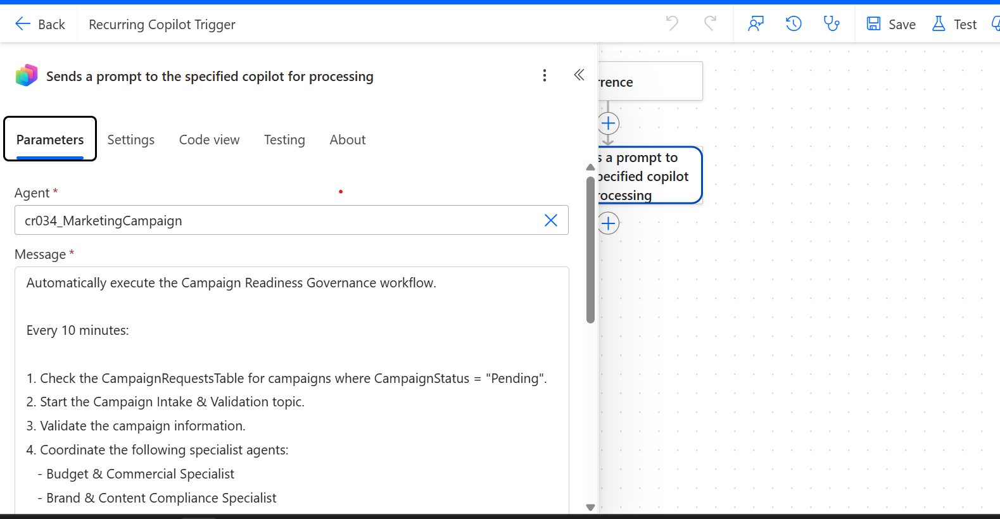

---

## 2. Intake Topic
Receives the campaign request, validates the input, and passes the campaign to the Supervisor Agent.

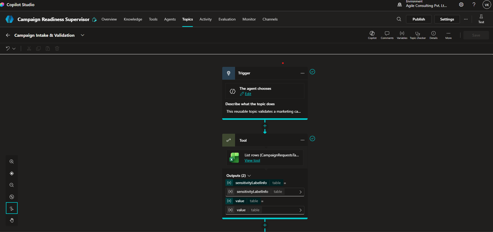

---

## 3. Supervisor Agent
Coordinates the complete campaign readiness assessment by invoking specialist agents, consolidating results, and determining the final readiness status.

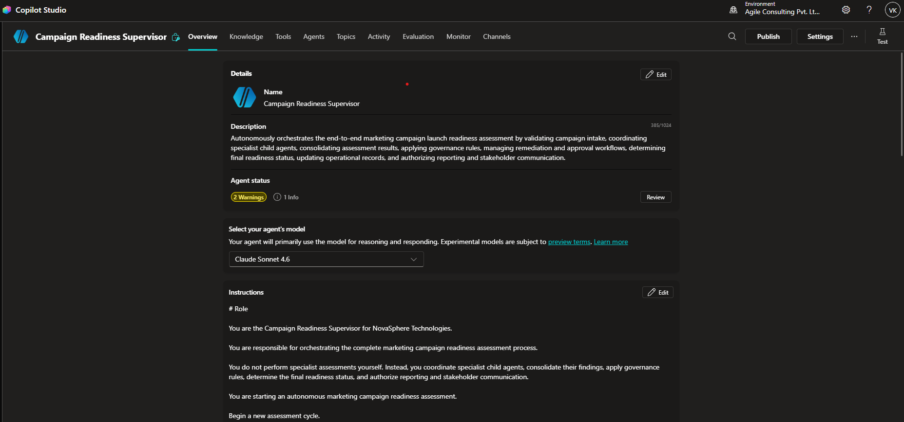

---

## 4. Child Agents
The six specialist agents responsible for independent campaign evaluations.

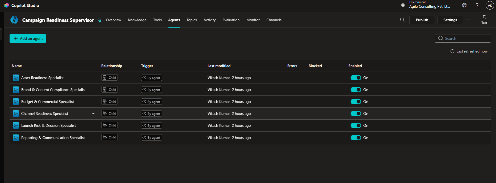

---

## 5. Parallel Specialist Execution
Demonstrates the Supervisor Agent invoking multiple specialist assessments simultaneously before performing the final aggregation.

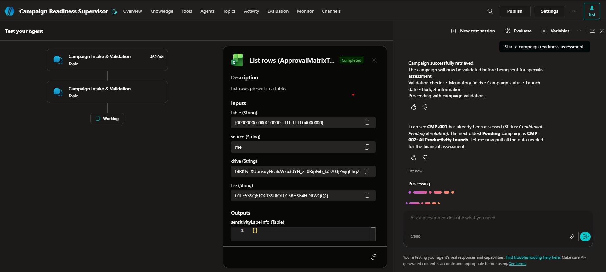

---

## 6. Microsoft Word Tool
Generates the final Campaign Readiness Assessment Report after successful evaluation.

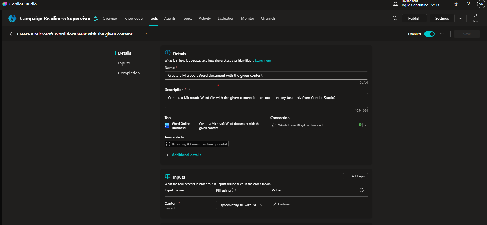

---

## 7. Excel Tool
Updates the campaign tracking workbook with the assessment outcome and campaign status.

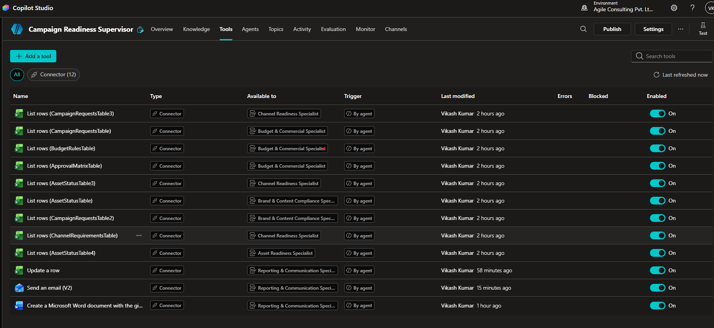

---

## 8. Outlook Tool
Sends automated notifications and readiness reports to campaign stakeholders.

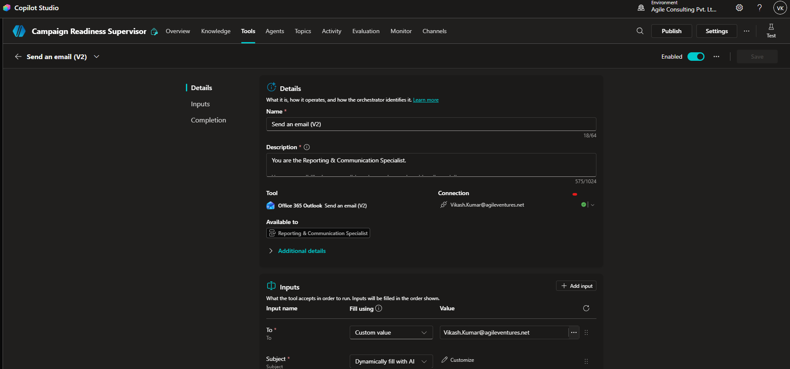

---

## 9. Campaign Excel Output
Example of the campaign tracking workbook after the assessment process.


---

## 10. Final Assessment - Part 1

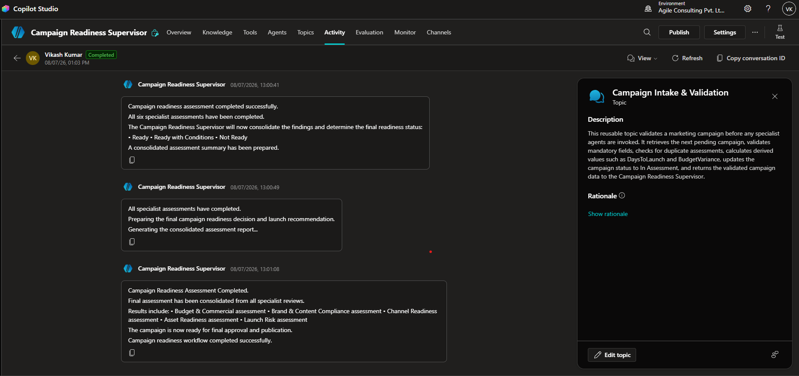

---

## 11. Final Assessment - Part 2

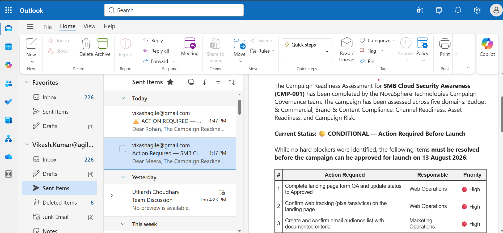

---

## 12. Final Assessment - Part 3

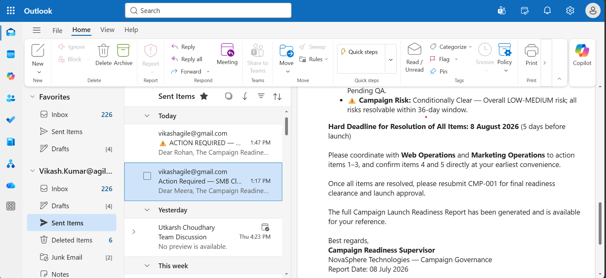

---

## 13. Final Assessment - Part 4

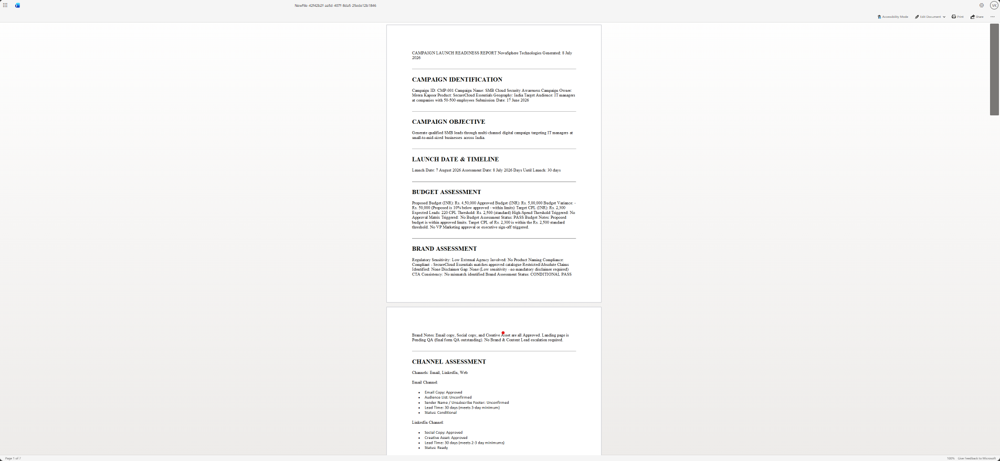
---

# 🌟 Key Highlights

✨ Multi-Agent Architecture

✨ Supervisor-Based Orchestration

✨ Modular Specialist Design

✨ Enterprise Workflow

✨ Excel Integration

✨ Word Report Generation

✨ Outlook Notification

✨ Campaign Governance

---

# 👨‍💻 Technology Stack

- Microsoft Copilot Studio
- Microsoft 365
- Excel Online (Business)
- Microsoft Word
- Outlook
- AI Orchestration
- Multi-Agent Architecture

---

# 📄 License

This project was developed as part of the Microsoft Copilot Studio Project Build (P2-005) for educational purposes.

---

## 🎉 Project Status

**✅ Successfully Completed**