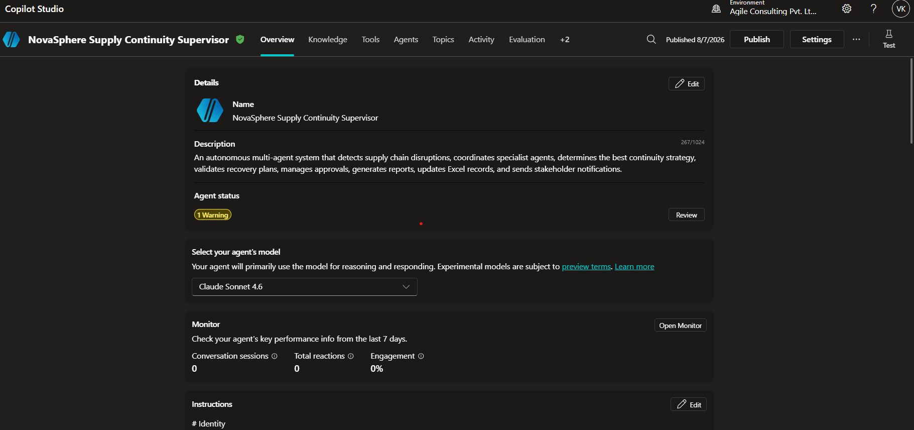
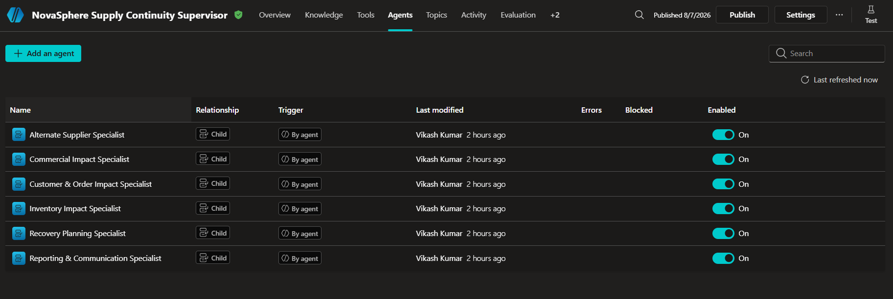
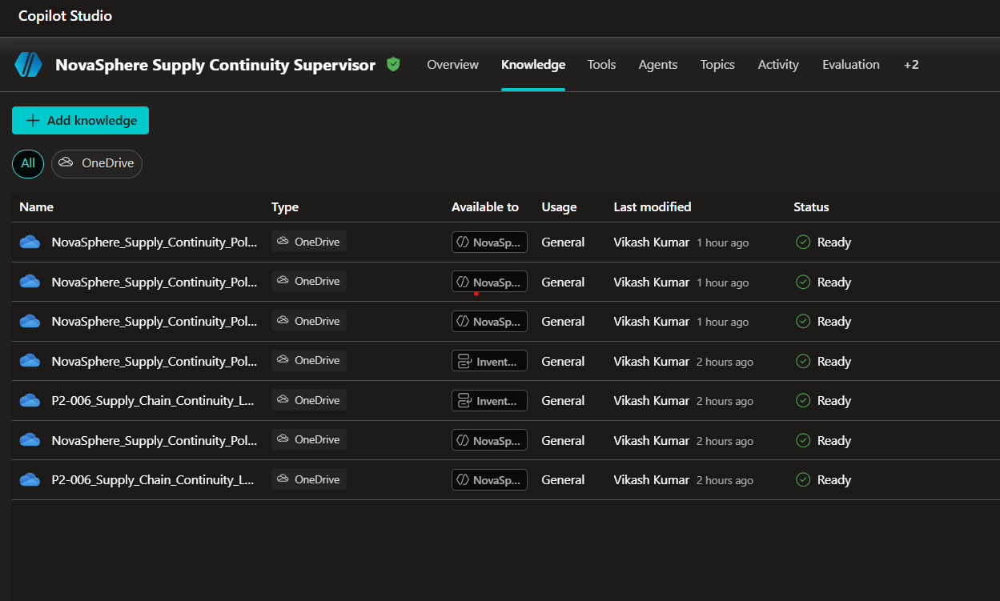
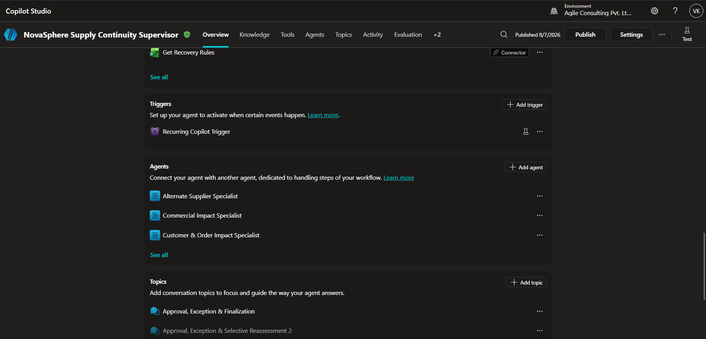
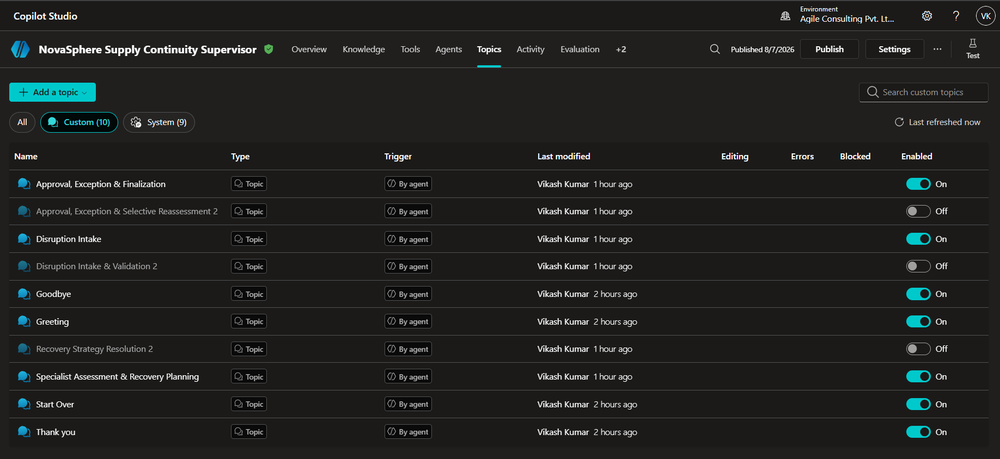
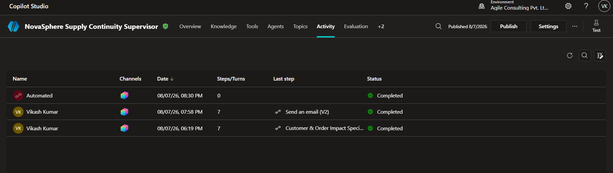
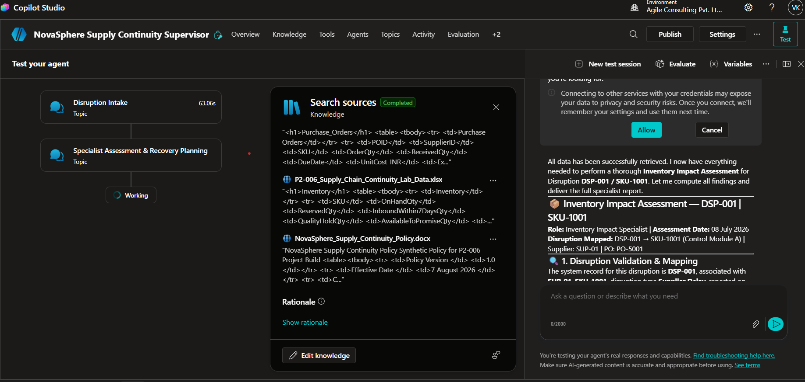
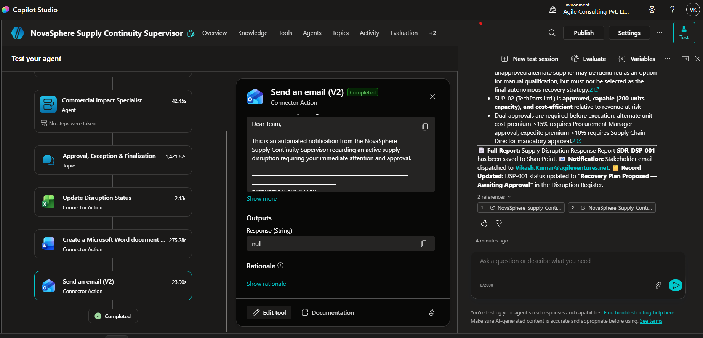
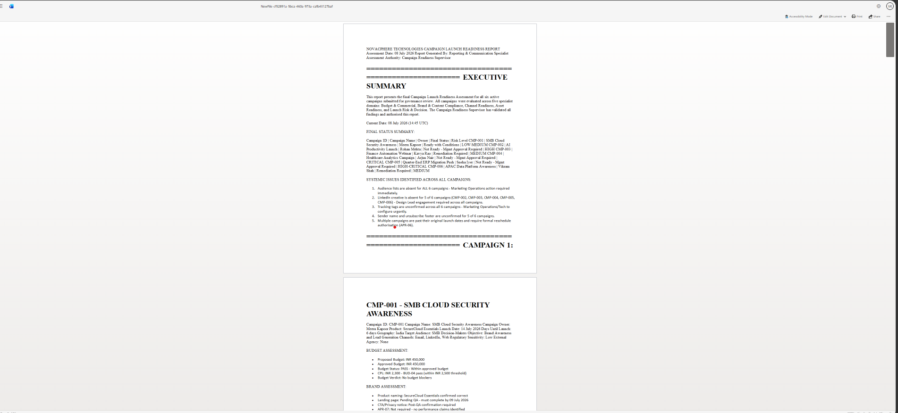
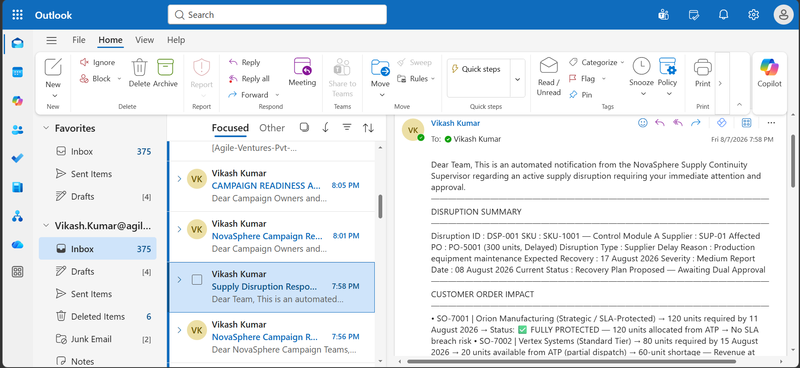

# 🚚 NovaSphere Supply Continuity Supervisor
### *P2-006 — Autonomous Multi-Agent Supply Chain Disruption Management System*

---

## 🌟 Project Overview

Modern supply chains operate in highly dynamic environments where supplier delays, inventory shortages, transportation failures, and commercial risks can rapidly disrupt business operations.

The **NovaSphere Supply Continuity Supervisor** is an **autonomous multi-agent orchestration solution** built in **Microsoft Copilot Studio** to intelligently assess supply chain disruptions, coordinate specialized AI agents, recommend optimal recovery strategies, and prepare business-ready recommendations for decision makers.

Rather than relying on a single monolithic AI assistant, the solution adopts a **Supervisor–Specialist architecture**, where the Supervisor coordinates multiple domain experts that independently analyze different aspects of the disruption before consolidating the findings into a unified recovery strategy.

---

# 🎯 Project Objectives

The solution aims to:

✅ Detect and validate supply disruptions

✅ Coordinate multiple AI specialists

✅ Analyze inventory, suppliers, customers, and commercial impact

✅ Recommend the optimal recovery strategy

✅ Apply business policies consistently

✅ Determine approval requirements

✅ Prepare stakeholder communication

✅ Support autonomous decision orchestration

---

# 🏗 Solution Architecture

```
                    ┌────────────────────────────┐
                    │  Recurrence Trigger        │
                    └──────────────┬─────────────┘
                                   │
                                   ▼
             ┌─────────────────────────────────────────┐
             │ NovaSphere Supply Continuity Supervisor │
             └──────────────┬──────────────────────────┘
                            │
       ┌────────────────────┼────────────────────┐
       │                    │                    │
       ▼                    ▼                    ▼
Topic 1              Topic 2               Topic 3
Validation      Specialist Assessment    Approval &
                                      Finalization
```

---

# 🤖 Multi-Agent Design

The system consists of one Supervisor Agent and six specialist agents.

| 👤 Agent | 🎯 Responsibility |
|----------|------------------|
| 🧭 Supervisor | Orchestrates the complete workflow |
| 📦 Inventory Impact Specialist | Inventory availability analysis |
| 🏭 Alternate Supplier Specialist | Supplier evaluation |
| 👥 Customer & Order Impact Specialist | Customer prioritization |
| 💰 Commercial Impact Specialist | Financial assessment |
| 🧩 Recovery Planning Specialist | Recovery strategy generation |
| 📝 Reporting & Communication Specialist | Executive summaries and communication drafts |

---

# 🧠 Orchestration Strategy

The solution demonstrates multiple orchestration patterns:

- 🔹 Sequential Orchestration
- 🔹 Fan-Out Specialist Assessment
- 🔹 Fan-In Consolidation
- 🔹 Supervisor Orchestration
- 🔹 Autonomous Decision Making

---

# 📚 Knowledge Sources

The Supervisor uses:

- 📄 NovaSphere Supply Continuity Policy
- 📊 Supply Chain Dataset

The knowledge source ensures all recommendations remain policy-driven.

---

# 🛠 Tools

The solution integrates with Microsoft 365 connectors.

| 🔧 Tool | Purpose |
|----------|----------|
| 📗 Excel Online | Retrieve operational data |
| 📑 Word (Draft Output) | Recovery summary generation |
| 📧 Outlook (Draft Output) | Stakeholder communication |

---

# 🗂 Custom Topics

Three reusable custom topics encapsulate the business workflow.

### 📍 Topic 1 — Disruption Intake & Validation

Validates disruption requests before specialist assessment begins.

---

### 📍 Topic 2 — Specialist Assessment & Recovery Planning

Coordinates specialist agents and generates the optimal recovery strategy.

---

### 📍 Topic 3 — Approval, Exception & Finalization

Determines approval requirements, manages exceptions, prepares reporting, and returns the final recommendation.

---

# ⚙ Business Workflow

```
Disruption
      │
      ▼
Validation
      │
      ▼
Inventory Assessment
      │
      ▼
Supplier Assessment
      │
      ▼
Customer Assessment
      │
      ▼
Commercial Assessment
      │
      ▼
Recovery Planning
      │
      ▼
Approval
      │
      ▼
Reporting
      │
      ▼
Final Recommendation
```

---

# 📁 Repository Structure

```
p2-006_supply_chain_disruption_order_continuity/
│
├── README.md
├── solution-summary.md
├── architecture.md
├── orchestration-patterns.md
├── supervisor-agent-design.md
├── specialist-agent-design.md
├── custom-topics.md
├── autonomous-trigger.md
├── decision-rules.md
├── test-report.md
├── known-limitations.md
├── ai-usage-declaration.md
│
├── data/
│   └── dataset-notes.md
│
└── screenshots/
```

---

# 🚀 Key Highlights

✨ Supervisor–Specialist Multi-Agent Architecture

🧠 Autonomous AI Orchestration

📊 Policy-Driven Decision Making

📦 Inventory Intelligence

🏭 Supplier Risk Assessment

👥 Customer Impact Analysis

💰 Commercial Impact Evaluation

🧩 Recovery Strategy Optimization

📑 Executive Reporting

🔄 Fan-Out / Fan-In Orchestration

---

# 📸 Screenshots

The repository includes screenshots demonstrating:

- 🖥 Supervisor Configuration
- 🤖 Child Agents
- 📚 Knowledge Sources
- 📌 Custom Topics
- 🔄 Orchestration Flow
- 📊 Excel Integration
- ✅ End-to-End Test Execution

# 📸 Solution Screenshots

The following screenshots demonstrate the implementation of the **NovaSphere Supply Continuity Supervisor** built using Microsoft Copilot Studio.

---

## 🧭 Supervisor Agent

The Supervisor Agent orchestrates the complete disruption management workflow by coordinating custom topics, specialist agents, and enterprise knowledge.



---

## 🤖 Specialist Child Agents

The solution follows a Supervisor–Specialist architecture consisting of six domain-specific child agents responsible for inventory, supplier, customer, commercial, recovery planning, and reporting activities.



---

## 📚 Knowledge Sources

The Supervisor uses enterprise knowledge to ensure policy-driven and explainable recommendations.

Knowledge Sources:

- NovaSphere Supply Continuity Policy
- Supply Chain Dataset



---

## ⏰ Autonomous Recurrence Trigger

The recurrence trigger enables autonomous execution by periodically initiating disruption assessments without manual intervention.




---

## 🧩 Custom Topics

The business workflow is divided into three reusable topics:

- Disruption Intake & Validation
- Specialist Assessment & Recovery Planning
- Approval, Exception & Finalization



---

## 📈 Activity History

The Activity page records workflow execution and provides visibility into the orchestration performed by the Supervisor Agent.



---

## ✅ Final Response – Example 1

The Supervisor returns a structured recovery recommendation after consolidating specialist assessments.



---

## ✅ Final Response – Example 2

A second end-to-end execution demonstrating policy-driven recommendations and workflow completion.



---

## ✅ Final Response – Example 3

A third end-to-end execution demonstrating policy-driven recommendations and workflow completion.



---

## ✅ Final Response – Example 4

A fourth end-to-end execution demonstrating policy-driven recommendations and workflow completion.



---
# Agent Link

```bash
https://copilotstudio.microsoft.com/environments/Default-1e1572ff-a54c-4cd7-b2a9-20091afa5359/bots/6b62d301-5992-f111-b8dc-000d3af21e08/overview
```
---

# Author

## Vikash Kumar
---

# 🏁 Conclusion

The **NovaSphere Supply Continuity Supervisor** demonstrates how Microsoft Copilot Studio can be used to build an autonomous, policy-driven, multi-agent supply chain management solution. By combining specialized AI agents with structured orchestration, the solution provides consistent, explainable, and scalable disruption management while keeping the Supervisor in control of the overall business workflow.