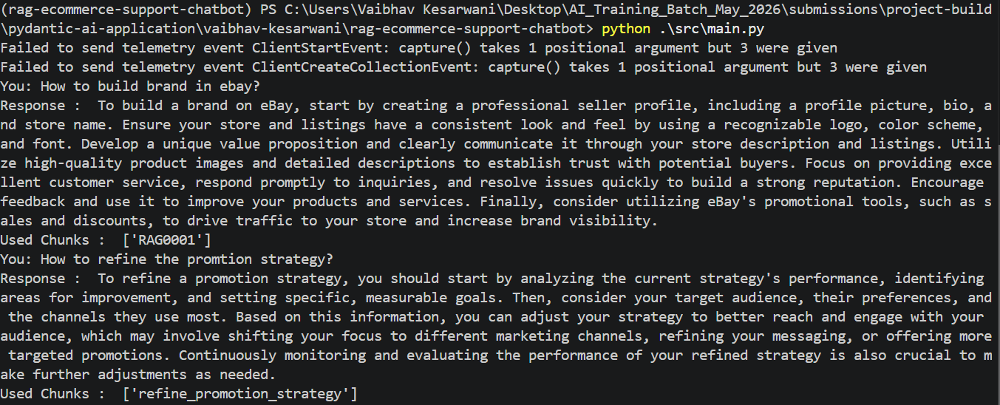

# Project Build 05 - Case Study 1: Production-Grade Marketplace RAG Support Agent

## Participant Name

**Vaibhav Kesarwani**

## Assignment Title

### Case Study 1: Production-Grade Marketplace RAG Support Agent

## Project overview

In this project we basically store the data of the pdf which is [`seller_guide.pdf`](./data/seller_guide.pdf) inside the vector DB which is `chromaDB` which is then after used to retrieve the related chunks from the database.

And, than after that we use the `Pydantic Agent` to describe the user query and retrieved chunks related to that query and than give that `RAG` as the tool to the `Agent`.

```py
@agent.tool()
def search_tool(ctx: RunContext[RagDeps], query: str) -> List[DocsChunk]:
    """
    Used to get the required chunks from the documents 
    according to the user query.

    Args:
        ctx: Documents chunks created from the pdf
        query: User Query    
    
    Return:
        return: The List of related chunks from the documents
    """

    return retrival_chunks(query=query, docs=ctx.deps.documents)
```

---

## Business Use Case

Modern e-commerce marketplaces require highly available, accurate, and secure automated support for their se ler ecosystems. The goal of this project is to build an enterprise-grade, production-ready Retrieval-Augmented Generation (RAG) chatbot for ShopSphere Marketplace, a platform hosting thousands of independent business selers. 

The chatbot must accurately ingest complex corporate guidelines—specificaly focusing on advanced business operations, fulfi lment strategies, se ler ratings, and profitability matrices. It must answer seler queries instantly while maintaining absolute deterministic safety standards, ensuring no toxic, profane, or ha lucinated outputs are surfaced to end-users. 

---

## Screen Shots



---

## Technology Stack

| Component              | Technology            |
| ---------------------- | --------------------- |
| Language               | Python 3.11+          |
| Framework              | Pydantic AI           |
| LLM Provider           | GROQ API              |
| Security               | Guardrails AI         |
| Testing                | Pydantic Evals        |

---

## Tools List

Ther is one tool which is implemented using the RAG concept and the chromadb database.

- RAG search tool

```py
@agent.tool()
def search_tool(ctx: RunContext[RagDeps], query: str) -> List[DocsChunk]:
    """
    Used to get the required chunks from the documents 
    according to the user query.

    Args:
        ctx: Documents chunks created from the pdf
        query: User Query    
    
    Return:
        return: The List of related chunks from the documents
    """

    return retrival_chunks(query=query, docs=ctx.deps.documents)
```

---

## Setup Instructions

### 1. Create Virtual Environment

```bash
uv venv
```

Activate the environment:

**Linux / macOS**

```bash
source venv/bin/activate
```

**Windows**

```bash
.venv\Scripts\activate
```

### 2. Install Dependencies

```bash
uv pip install -r requirements.txt
```

---

## Environment Variables Required

Create a `.env` file:

```env
GROQ_API_KEY="..."
GROQ_MODEL=groq:llama-3.3-70b-versatile
```

---

## To Run the Porject

TO run the agent use the below command to ask your query related to the `seller_guide.pdf`.

```bash
python src/main.py
```

---

## GuardRails Security

To prevent the prompt injection and unappropraite output we are using the `LlmRagEvaluator` from the `Guardrails AI` which internally use the Profanity and Toxicity validators

```py
from guardrails import Guard
from guardrails.hub import LlmRagEvaluator
from dotenv import load_dotenv
from agent import agent

load_dotenv()

guard = Guard().use(LlmRagEvaluator(on_fail="exception"))
model = "openai/gpt-oss-20b"

response = guard(
    agent,
    messages={"role" : "user", "content" : "Tell me the ebay sells"},
    model=model,
)

print("Validation Output : ", response.validated_output)
print("Validation Passed : ", response.validation_passed)
```

And, to install the `LlmRagEvaluator` can download it from the Guardrails hub

```bash
guardrails hub install hub://arize-ai/llm_rag_evaluator
```

---

## Agent Evaluation

For evaluating the `pydantic agent` we use the `pydantic evaluation` to evaluate the agent response throught different cases.

```py
datasets = Dataset[RagInputs, RagOutput](
    cases=[
        Case(
            name="profitability",
            inputs=RagInputs(
                query="what is the profitability to the seller?",
                expected_docs=["5", "6"],
                grounded_answer="A business's ability to increase its profits or profit margin."
            )
        ),
        Case(
            name="optimize_automate",
            inputs=RagInputs(
                query="How to optimize and automate the shipping time?",
                expected_docs=["7", "8", "9"],
                grounded_answer="When you let packages pile up, getting them out the door tends to take more time. ..."
            )
        ),
        .....
    ]
)
```

---

## Project Structure

```bash
 rag-ecommerce-support-chatbot/ 
    ├── data/         
    │   └── seller_guide.pdf 
    ├── chroma_db/            
    ├── assets/            
    ├── src/         
    │   ├── main.py 
    │   ├── prompts.py 
    │   ├── retreiver.py 
    │   ├── schema.py 
    │   ├── agent.py 
    │   ├── guardrails_config.py 
    │   └── database.py 
    ├── tests/                
    │   └── test_rag_metrics.py 
    ├── README.md              
    └── requirements.txt      
```

---

## Future Improvements

1. Make the `UI/UX` for the better user experience using the `streamlit` or `gradio`.

2. Make the chromadb retrieval faster using the different searching techinques.